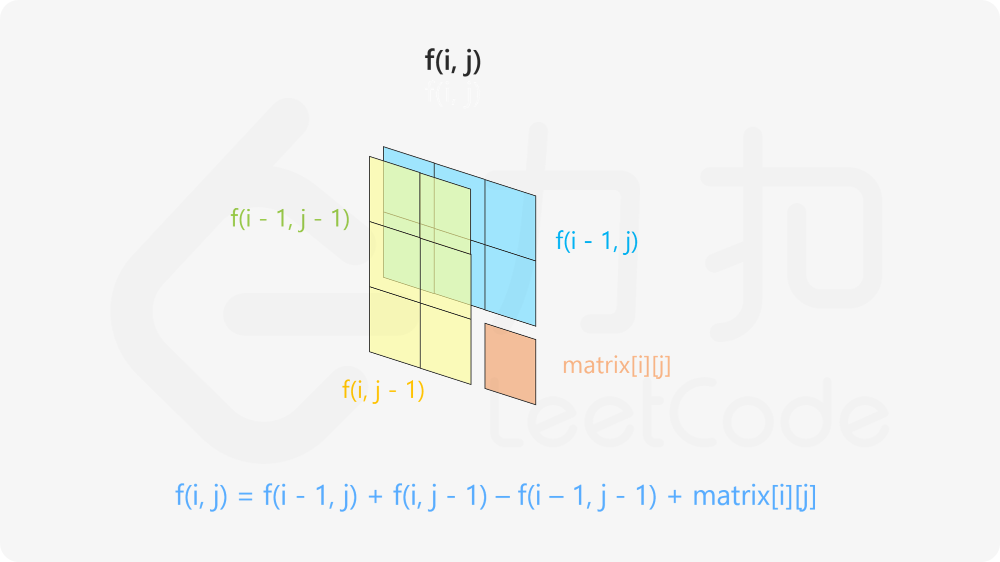

## 1. n 数之和

| 题目链接                                                          | 题解                                                                                                                                         | 备注                      |
|---------------------------------------------------------------|--------------------------------------------------------------------------------------------------------------------------------------------|-------------------------|
| [1. 两数之和 简单](https://leetcode.cn/problems/two-sum/)           | [Solution1.java](src%2Fleetcode%2Fnsum%2FSolution1.java)                                                                                   |                         |
| [15. 三数之和 中等](https://leetcode.cn/problems/3sum/)             | [Solution15.java](src%2Fleetcode%2Fnsum%2FSolution15.java); <br/>[Solution15TwoPointer.java](src%2Fleetcode%2Fnsum%2FSolution15TwoPointer.java) | 优先看双指针解法，第一种解法时间复杂度相对较大 |
| [16. 最接近的三数之和 中等](https://leetcode.cn/problems/3sum-closest/) | [Solution16.java](src%2Fleetcode%2Fnsum%2FSolution16.java)                                                                                 |                         |
| [18. 四数之和 中等](https://leetcode.cn/problems/4sum/)             | [Solution18.java](src%2Fleetcode%2Fnsum%2FSolution18.java)                                                                                 |                         |

## 2. 二分查找

**思路很简单，细节是魔鬼**。使用二分查找法的标志不是数组有序（单调）而是**数据的两段性**，只要一段满足某个性质，另一段不满足某个性质，那么就可以使用二分法。
双闭区间模板如下，不过注意其中的细节可能改变。

```java
    int binarySearch(int[] nums, int target) {
        int left = 0, right = nums.length - 1;

        // 这里变？
        while (left <= right) {
            int mid = left + (right - left) / 2;

            if (nums[mid] < target) {
                // 这里变？
                left = mid + 1;
            } else if (nums[mid] > target) {
                // 这里变？
                right = mid - 1;
            } else {
                // 还是这里变？
                return mid;
            }
        }

        return -1;
    }
```

### 数组有序

1. [剑指 Offer 53 - I. 在排序数组中查找数字 I 简单](https://leetcode.cn/problems/zai-pai-xu-shu-zu-zhong-cha-zhao-shu-zi-lcof/)
2. [154. 寻找旋转排序数组中的最小值 II 困难](https://leetcode.cn/problems/find-minimum-in-rotated-sorted-array-ii/)
3. [剑指 Offer 04. 二维数组中的查找 中等](https://leetcode.cn/problems/er-wei-shu-zu-zhong-de-cha-zhao-lcof/)

### 数组无序

1. [162. 寻找峰值 中等](https://leetcode.cn/problems/find-peak-element/)

## 3. 双指针

双指针解题考虑点

- 数组是否有序？
- 初始指针怎么定义，是在用一个位置还是在数组两边？
- 指针移动的条件是什么？
- 是否有连续子数组、连续子字符串要求？有的话优先考虑滑动窗口

针对数组中两个值的问题，从数组两边开始找的情况；针对回文串问题，从两边开始比

| 题目链接                                                                                                                                  | 题解                                                                          | 备注 |
|---------------------------------------------------------------------------------------------------------------------------------------|-----------------------------------------------------------------------------|----|
| [1438. 绝对差不超过限制的最长连续子数组 中等](https://leetcode.cn/problems/longest-continuous-subarray-with-absolute-diff-less-than-or-equal-to-limit/) | [Solution1438.java](src%2Fleetcode%2Fqueue%2Fmonotonic%2FSolution1438.java) |    |

1. [15. 三数之和 中等](https://leetcode.cn/problems/3sum/)
2. [11. 盛最多水的容器 中等](https://leetcode.cn/problems/container-with-most-water/)
3. [剑指 Offer 21. 调整数组顺序使奇数位于偶数前面 简单](https://leetcode.cn/problems/diao-zheng-shu-zu-shun-xu-shi-qi-shu-wei-yu-ou-shu-qian-mian-lcof/)
4. [125. 验证回文串 简单](https://leetcode.cn/problems/valid-palindrome/)

两个有序数组的合并问题，一个数组分别一个指针

1. [面试题 10.01. 合并排序的数组 简单](https://leetcode.cn/problems/sorted-merge-lcci/)

## 4. 滑动窗口

滑动窗口的变化条件**需要有准确的规则**。如果数组是无序且包含的元素并**不都是非负数**的话，往往窗口的变化条件比较难判断，可能无法使用该方法求解

| 题目链接                                                                        | 题解                                                                    | 备注 |
|-----------------------------------------------------------------------------|-----------------------------------------------------------------------|----|
| [209. 长度最小的子数组 中等](https://leetcode.cn/problems/minimum-size-subarray-sum/) | [Solution209.java](src%2Fleetcode%2Fslidingwindow%2FSolution209.java) |    |

2. [剑指 Offer 57 - II. 和为s的连续正数序列 简单](https://leetcode.cn/problems/he-wei-sde-lian-xu-zheng-shu-xu-lie-lcof/)
3. [713. 乘积小于 K 的子数组 中等](https://leetcode.cn/problems/subarray-product-less-than-k/)
4. [56. 合并区间 中等](https://leetcode.cn/problems/merge-intervals/)
5. [剑指 Offer 48. 最长不含重复字符的子字符串 中等](https://leetcode.cn/problems/zui-chang-bu-han-zhong-fu-zi-fu-de-zi-zi-fu-chuan-lcof/)
6. [76. 最小覆盖子串 困难](https://leetcode.cn/problems/minimum-window-substring/)

## 5. 前缀和

连续子数组求和，不涉及元素值变化

### 一维数组前缀和

| 题目链接                                                                             | 题解                                                                | 备注                  |
|----------------------------------------------------------------------------------|-------------------------------------------------------------------|---------------------|
| [303. 区域和检索 - 数组不可变 简单](https://leetcode.cn/problems/range-sum-query-immutable/) | [NumArray.java](src%2Fleetcode%2Fprefixsum%2FNumArray.java)       |                     |
| [238. 除自身以外数组的乘积 中等](https://leetcode.cn/problems/product-of-array-except-self/) | [Solution238.java](src%2Fleetcode%2Fprefixsum%2FSolution238.java) |                     |
| [396. 旋转函数 中等](https://leetcode.cn/problems/rotate-function/)                    | [Solution396.java](src%2Fleetcode%2Fprefixsum%2FSolution396.java) | 暴力法会直接超时，解决本题需要推导一下 |

1. [560. 和为 K 的子数组 中等](https://leetcode.cn/problems/subarray-sum-equals-k/)
2. [525. 连续数组 中等](https://leetcode.cn/problems/contiguous-array/)

### 二维数组前缀和

我觉得 304 题是二维数组前缀和的代表性题目，熟悉它的解题思路之后，大概几分钟就能解出来。我们以计算 `matrix[i][j]` 处的前缀和为例，其中二维数组中每个元素表示以 `[0, 0]` 为左上角，以当前元素 `[i, j]` 为右下角构成的矩阵的前缀和，在计算 `matrix[i][j]` 之前，我们先来看一下官方题解给出示例图，我觉得记住这张图能的推导出计算公式：



计算 `matrix[i][j]` 我们能够依靠已知的前缀和 `matrix[i - 1][j - 1]`、`matrix[i - 1][j]` 和 `matrix[i][j - 1]`，其实我们可以轻易的根据图示得出 `matrix[i][j] = matrix[i - 1][j] + matrix[i][j - 1] - matrix[i - 1][j - 1]`，为什么要减去 `matrix[i - 1][j - 1]` 呢，因为在 `matrix[i - 1][j]` 和 `matrix[i][j - 1]` 中都包含着 `matrix[i - 1][j - 1]`，我们做加和计算时把 `matrix[i - 1][j - 1]` 加了两遍，所以需要再减去一个，记住这个图示之后遇到类似的题推导一下就可以了，不必记住模板。

| 题目链接                                                                                  | 题解                                                            | 备注 |
|---------------------------------------------------------------------------------------|---------------------------------------------------------------|----|
| [304. 二维区域和检索 - 矩阵不可变 中等](https://leetcode.cn/problems/range-sum-query-2d-immutable/) | [NumMatrix.java](src%2Fleetcode%2Fprefixsum%2FNumMatrix.java) |    |

## 6. 差分

## 7. 树状数组

树状数组是一种简单的数据结构，它支持单点修改和区间查询操作，一般的 RMQ 问题优先选择树状数组求解，而不是线段树，后者相对来说代码量大，也比较复杂

- 树状数组解题模板：[BinaryIndexedTree.java](src%2Fleetcode%2Fbinaryindexedtree%2FBinaryIndexedTree.java)

| 题目链接                                                                                                       | 题解                                                                          | 备注 |
|------------------------------------------------------------------------------------------------------------|-----------------------------------------------------------------------------|----|
| [307. 区域和检索 - 数组可修改 中等](https://leetcode.cn/problems/range-sum-query-mutable/)                             | [NumArray.java](src%2Fleetcode%2Fbinaryindexedtree%2FNumArray.java)         |    |
| [1310. 子数组异或查询 中等](https://leetcode.cn/problems/xor-queries-of-a-subarray/)                                | [Solution1310.java](src%2Fleetcode%2Fbinaryindexedtree%2FSolution1310.java) |    |
| [1395. 统计作战单位数 中等](https://leetcode.cn/problems/count-number-of-teams/)                                    | [Solution1395.java](src%2Fleetcode%2Fbinaryindexedtree%2FSolution1395.java) |    |
| [775. 全局倒置与局部倒置 中等](https://leetcode.cn/problems/global-and-local-inversions/)                             | [Solution775.java](src%2Fleetcode%2Fbinaryindexedtree%2FSolution775.java)   |    |
| [327. 区间和的个数 困难](https://leetcode.cn/problems/count-of-range-sum/)                                         |                                                                             |    |

## 8. 线段树

线段树可以解决区间和、区间最大值或区间最小值的问题（RMQ 问题），不过线段树的代码量相对来说较大而且比较复杂，所以线段树是在前缀和、差分和树状数组解决方法之后不得已才会考虑的方案。
一般使用线段树的题目都具备 **区间修改和区间查询** 的特点，如果大家在这里是按照顺序刷的话，应该对 RAM 问题有一个比较充分的了解了，所以我在这里也做一下题型解法的归纳：

- 数组不变，区间查询：前缀和、树状数组和线段树
- 数组单点修改，区间查询：树状数组和线段树
- 数组区间修改，单点查询：差分和线段树
- 数组区间修改，区间查询：线段树

注意每种题型涉及的解法都是越靠前越优先考虑。

### 单点修改和区间查询

- 线段树模板：[SegmentTree.java](src%2Fleetcode%2Fsegmenttree%2FSegmentTree.java)

| 题目链接                                                                                                       | 题解                                                                    | 备注 |
|------------------------------------------------------------------------------------------------------------|-----------------------------------------------------------------------|----|
| [307. 区域和检索 - 数组可修改 中等](https://leetcode.cn/problems/range-sum-query-mutable/)                             | [NumArray.java](src%2Fleetcode%2Fsegmenttree%2FNumArray.java)         |    |
| [239. 滑动窗口最大值 困难](https://leetcode.cn/problems/sliding-window-maximum/)                                    | [Solution239.java](src%2Fleetcode%2Fsegmenttree%2FSolution239.java)   |    |
| [654. 最大二叉树 中等](https://leetcode.cn/problems/maximum-binary-tree/)                                         | [Solution654.java](src%2Fleetcode%2Fsegmenttree%2FSolution654.java)   |    |

### 区间修改

- 线段树模板：[SegmentTree2.java](src%2Fleetcode%2Fsegmenttree%2FSegmentTree2.java)

| 题目链接                                                                                                       | 题解                                                                    | 备注 |
|------------------------------------------------------------------------------------------------------------|-----------------------------------------------------------------------|----|
| [1893. 检查是否区域内所有整数都被覆盖 简单](https://leetcode.cn/problems/check-if-all-the-integers-in-a-range-are-covered/) | [Solution1893.java](src%2Fleetcode%2Fsegmenttree%2FSolution1893.java) |    |
| [1109. 航班预订统计 中等](https://leetcode.cn/problems/corporate-flight-bookings/)                                 | [Solution1109.java](src%2Fleetcode%2Fsegmenttree%2FSolution1109.java) |    |

### 动态开点

- 线段树模版：[SegmentTree3.java](src%2Fleetcode%2Fsegmenttree%2FSegmentTree3.java)

| 题目链接                                                                 | 题解                                                                          | 备注 |
|----------------------------------------------------------------------|-----------------------------------------------------------------------------|----|
| [729. 我的日程安排表 I 中等](https://leetcode.cn/problems/my-calendar-i/)     | [MyCalendar.java](src%2Fleetcode%2Fsegmenttree%2FMyCalendar.java)           |    |
| [731. 我的日程安排表 II 中等](https://leetcode.cn/problems/my-calendar-ii/)   | [MyCalendarTwo.java](src%2Fleetcode%2Fsegmenttree%2FMyCalendarTwo.java)     | ⭐️ |
| [732. 我的日程安排表 III 困难](https://leetcode.cn/problems/my-calendar-iii/) | [MyCalendarThree.java](src%2Fleetcode%2Fsegmenttree%2FMyCalendarThree.java) |    |
| [715. Range 模块 困难](https://leetcode.cn/problems/range-module/)       | [RangeModule.java](src%2Fleetcode%2Fsegmenttree%2FRangeModule.java)         |    |

## 9. 字符串

### 字符串操作

- `s.trim()` 去掉字符串两边的空格

1. [14. 最长公共前缀 简单](https://leetcode.cn/problems/longest-common-prefix/)
2. [151. 反转字符串中的单词 中等](https://leetcode.cn/problems/reverse-words-in-a-string/)

### 字符转数字

- `s.charAt(i) - '0'` = 数字
- `Integer.parseInt()` 字符串转整数自动忽略前导0

1. [165. 比较版本号 中等](https://leetcode.cn/problems/compare-version-numbers/):
2. [8. 字符串转换整数 (atoi) 中等](https://leetcode.cn/problems/string-to-integer-atoi/)
3. [43. 字符串相乘 中等](https://leetcode.cn/problems/multiply-strings/)

## 10. 链表

链表是一种 **递归** 的数据结构，与数组不同的是它不需要占用连续的内存空间，但是需要额外的空间保存后继节点的指针，以此将所有的链表节点串联起来。它的删除和插入操作比较高效，时间复杂度为 $O(1)$，但是想访问链表中某个值时，需要对链表进行遍历，时间复杂度为 $O(n)$。**链表是数组的一种重要的替代方式**。

### 链表反转

```java
    public ListNode reverseList(ListNode head) {
        ListNode pre = null;

        while (head != null) {
            ListNode temp = head.next;
            head.next = pre;
            pre = head;
            head = temp;
        }

        return pre;
    }
```

| 题目链接                                                                           | 题解                                                                         | 备注       |
|--------------------------------------------------------------------------------|----------------------------------------------------------------------------|----------|
| [剑指 Offer 24. 反转链表 简单](https://leetcode.cn/problems/fan-zhuan-lian-biao-lcof/) | [SolutionOffer24.java](src%2Fleetcode%2Flinkedlist%2FSolutionOffer24.java) |          |
| [234. 回文链表 简单](https://leetcode.cn/problems/palindrome-linked-list/)           | [Solution234.java](src%2Fleetcode%2Flinkedlist%2FSolution234.java)         | 快慢指针分开链表 |
| [92. 反转链表 II 中等](https://leetcode.cn/problems/reverse-linked-list-ii/)         | [Solution92.java](src%2Fleetcode%2Flinkedlist%2FSolution92.java)           |          |
| [25. K 个一组翻转链表 困难](https://leetcode.cn/problems/reverse-nodes-in-k-group/)     | [Solution25.java](src%2Fleetcode%2Flinkedlist%2FSolution25.java)           |          |

### 递归

| 题目链接                                                                                                 | 题解                                                                         | 备注                          |
|------------------------------------------------------------------------------------------------------|----------------------------------------------------------------------------|-----------------------------|
| [剑指 Offer 06. 从尾到头打印链表 简单](https://leetcode.cn/problems/cong-wei-dao-tou-da-yin-lian-biao-lcof/)     | [SolutionOffer06.java](src%2Fleetcode%2Flinkedlist%2FSolutionOffer06.java) |                             |
| [剑指 Offer 35. 复杂链表的复制 中等](https://leetcode.cn/problems/fu-za-lian-biao-de-fu-zhi-lcof/)              | [SolutionOffer35.java](src%2Fleetcode%2Flinkedlist%2FSolutionOffer35.java) |                             |
| [24. 两两交换链表中的节点 中等](https://leetcode.cn/problems/swap-nodes-in-pairs/)                               | [Solution24.java](src%2Fleetcode%2Flinkedlist%2FSolution24.java)           |                             |
| [剑指 Offer 25. 合并两个排序的链表 简单](https://leetcode.cn/problems/he-bing-liang-ge-pai-xu-de-lian-biao-lcof/) | [SolutionOffer25.java](src%2Fleetcode%2Flinkedlist%2FSolutionOffer25.java) |                             |
| [23. 合并K个升序链表 困难](https://leetcode.cn/problems/merge-k-sorted-lists/)                                | [Solution23.java](src%2Fleetcode%2Flinkedlist%2FSolution23.java)           | 分治的思想(想想归并排序)               |
| [148. 排序链表 中等](https://leetcode.cn/problems/sort-list/)                                              | [Solution148.java](src%2Fleetcode%2Flinkedlist%2FSolution148.java)         | 也是分治的思想，但是它的难度是中等，其实和上一题差不多 |
| [430. 扁平化多级双向链表 中等](https://leetcode.cn/problems/flatten-a-multilevel-doubly-linked-list/)           | [Solution430.java](src%2Fleetcode%2Flinkedlist%2FSolution430.java)         |                             |

### 双指针、快慢指针

| 题目链接                                                                                                     | 题解                                                                         | 备注 |
|----------------------------------------------------------------------------------------------------------|----------------------------------------------------------------------------|----|
| [剑指 Offer 22. 链表中倒数第k个节点 简单](https://leetcode.cn/problems/lian-biao-zhong-dao-shu-di-kge-jie-dian-lcof/) | [SolutionOffer22.java](src%2Fleetcode%2Flinkedlist%2FSolutionOffer22.java) |    |
| [141. 环形链表 简单](https://leetcode.cn/problems/linked-list-cycle/)                                          | [Solution141.java](src%2Fleetcode%2Flinkedlist%2FSolution141.java)         |    |
| [142. 环形链表 II 中等](https://leetcode.cn/problems/linked-list-cycle-ii/)                                    | [Solution142.java](src%2Fleetcode%2Flinkedlist%2FSolution142.java)         |    |
| [160. 相交链表 简单](https://leetcode.cn/problems/intersection-of-two-linked-lists/)                           | [Solution160.java](src%2Fleetcode%2Flinkedlist%2FSolution160.java)         |    |

### 前驱节点在删除链表节点中的应用

| 题目链接                                                                                          | 题解                                                                         | 备注 |
|-----------------------------------------------------------------------------------------------|----------------------------------------------------------------------------|----|
| [剑指 Offer 18. 删除链表的节点 简单](https://leetcode.cn/problems/shan-chu-lian-biao-de-jie-dian-lcof/)  | [SolutionOffer18.java](src%2Fleetcode%2Flinkedlist%2FSolutionOffer18.java) |    |
| [83. 删除排序链表中的重复元素 简单](https://leetcode.cn/problems/remove-duplicates-from-sorted-list/)       | [Solution83.java](src%2Fleetcode%2Flinkedlist%2FSolution83.java)           |    |
| [82. 删除排序链表中的重复元素 II 中等](https://leetcode.cn/problems/remove-duplicates-from-sorted-list-ii/) | [Solution82.java](src%2Fleetcode%2Flinkedlist%2FSolution82.java)           |    |
| [19. 删除链表的倒数第 N 个结点 中等](https://leetcode.cn/problems/remove-nth-node-from-end-of-list/)       | [Solution19.java](src%2Fleetcode%2Flinkedlist%2FSolution19.java)           |    |
| [725. 分隔链表 中等](https://leetcode.cn/problems/split-linked-list-in-parts/)                      | [Solution725.java](src%2Fleetcode%2Flinkedlist%2FSolution725.java)         |    |

### 推导

| 题目链接                                                                    | 题解                                                                               | 备注 |
|-------------------------------------------------------------------------|----------------------------------------------------------------------------------|----|
| [328. 奇偶链表 中等](https://leetcode.cn/problems/odd-even-linked-list/)      | [Solution328.java](src%2Fleetcode%2Flinkedlist%2FSolution328.java)               |    |
| [382. 链表随机节点 中等](https://leetcode.cn/problems/linked-list-random-node/) | [Solution382.java](src%2Fleetcode%2Flinkedlist%2FSolution382.java)               |    |
| [剑指 Offer II 029. 排序的循环链表 中等](https://leetcode.cn/problems/4ueAj6/)     | [SolutionOfferTwo29.java](src%2Fleetcode%2Flinkedlist%2FSolutionOfferTwo29.java) |    |
| [面试题 02.05. 链表求和 中等](https://leetcode.cn/problems/sum-lists-lcci/)      | [Solution0205.java](src%2Fleetcode%2Flinkedlist%2FSolution0205.java)             |    |
| [445. 两数相加 II 中等](https://leetcode.cn/problems/add-two-numbers-ii/)     | [Solution445.java](src%2Fleetcode%2Flinkedlist%2FSolution445.java)               |    |
| [817. 链表组件 中等](https://leetcode.cn/problems/linked-list-components/)    | [Solution817.java](src%2Fleetcode%2Flinkedlist%2FSolution817.java)               |    |

## 11. 数据结构

| 题目链接                                                                              | 题解                                                                            | 备注 |
|-----------------------------------------------------------------------------------|-------------------------------------------------------------------------------|----|
| [146. LRU 缓存 中等](https://leetcode.cn/problems/lru-cache/)                         | [LRUCacheHashMap.java](src%2Fleetcode%2Fdatastructure%2FLRUCacheHashMap.java) |    |
| [460. LFU 缓存 困难](https://leetcode.cn/problems/lfu-cache/)                         | [LFUCache.java](src%2Fleetcode%2Fdatastructure%2FLFUCache.java)               |    |
| [432. 全 O(1) 的数据结构 困难](https://leetcode.cn/problems/all-oone-data-structure/)     | [AllOne.java](src%2Fleetcode%2Fdatastructure%2FAllOne.java)                   |    |
| [707. 设计链表 中等](https://leetcode.cn/problems/design-linked-list/)                  | [MyLinkedList.java](src%2Fleetcode%2Fdatastructure%2FMyLinkedList.java)       |    |
| [641. 设计循环双端队列 中等](https://leetcode.cn/problems/design-circular-deque/)           | [MyCircularDeque.java](src%2Fleetcode%2Fdatastructure%2FMyCircularDeque.java) |    |
| [1206. 设计跳表 困难](https://leetcode.cn/problems/design-skiplist/)                    |                                                                               |    |
| [208. 实现 Trie (前缀树) 中等](https://leetcode.cn/problems/implement-trie-prefix-tree/) |                                                                               |    |

## 12. 栈

栈是一种基于 **后进先出（LIFO）策略** 的集合类型，这就需要我们在对值进行处理时注意结果值有没有对顺序的要求，因为入栈到出栈是倒序的。

- 应用: 函数调用栈、括号的匹配、双栈实现浏览器的前进和后退功能、JVM栈、电子邮件的存放、算数表达式的求值(操作数栈和运算符栈)

| 题目链接                                                                                                     | 题解                                                                                          | 备注 |
|----------------------------------------------------------------------------------------------------------|---------------------------------------------------------------------------------------------|----|
| [20. 有效的括号 简单](https://leetcode.cn/problems/valid-parentheses/)                                          | [Solution20.java](src%2Fleetcode%2Fstack%2FSolution20.java)                                 |    |
| [232. 用栈实现队列 简单](https://leetcode.cn/problems/implement-queue-using-stacks/)                             | [MyQueue.java](src%2Fleetcode%2Fstack%2FMyQueue.java)                                       |    |
| [155. 最小栈 中等](https://leetcode.cn/problems/min-stack/)                                                   | [MinStack.java](src%2Fleetcode%2Fstack%2FMinStack.java)                                     |    |
| [946. 验证栈序列 中等](https://leetcode.cn/problems/validate-stack-sequences/)                                  | [Solution946.java](src%2Fleetcode%2Fstack%2FSolution946.java)                               |    |
| [71. 简化路径 中等](https://leetcode.cn/problems/simplify-path/)                                               | [Solution71.java](src%2Fleetcode%2Fstack%2FSolution71.java)                                 |    |
| [1190. 反转每对括号间的子串 中等](https://leetcode.cn/problems/reverse-substrings-between-each-pair-of-parentheses/) | [Solution1190.java](src%2Fleetcode%2Fstack%2FSolution1190.java)                             |    |
| [385. 迷你语法分析器 中等](https://leetcode.cn/problems/mini-parser/)                                             | [【宫水三叶】栈运用模拟题](https://leetcode.cn/problems/mini-parser/solutions/1422125/by-ac_oier-zuy6/) |    |
| [636. 函数的独占时间 中等](https://leetcode.cn/problems/exclusive-time-of-functions/)                             | [Solution636.java](src%2Fleetcode%2Fstack%2FSolution636.java)                               |    |
| [735. 行星碰撞 中等](https://leetcode.cn/problems/asteroid-collision/)                                         | [Solution735.java](src%2Fleetcode%2Fstack%2FSolution735.java)                               |    |
| [856. 括号的分数 中等](https://leetcode.cn/problems/score-of-parentheses/)                                      | [Solution856.java](src%2Fleetcode%2Fstack%2FSolution856.java)                               |    |
| [1106. 解析布尔表达式 困难](https://leetcode.cn/problems/parsing-a-boolean-expression/)                           | [Solution1106.java](src%2Fleetcode%2Fstack%2FSolution1106.java)                             |    |
| [32. 最长有效括号 困难](https://leetcode.cn/problems/longest-valid-parentheses/)                                 | [Solution32.java](src%2Fleetcode%2Fstack%2FSolution32.java)                                 |    |
| [726. 原子的数量 困难](https://leetcode.cn/problems/number-of-atoms/)                                           | [Solution726.java](src%2Fleetcode%2Fstack%2FSolution726.java)                               |    |

### 单调栈

顺序遍历数组入栈，如果遇到 **比栈顶元素小的值则出栈** 的栈为 **单调递增栈**，**该较小的值即为即将出栈的元素右侧最近的小值**，元素出栈后若有 **栈顶元素**，该元素为出栈元素 **左侧最近的小值**。

最终遍历完序列后，如果栈内还有元素的话，则为递增序列，那么我们需要检查是否需要对栈中剩余的元素进行处理。

一般单调栈的题目会有 **在连续序列中找左/右侧最大或最小值** 的特点，此外我们还可以借助单调栈来 **维护区间内的最小值/最大值的序列**，而且 **不要局限** 在只使用一个单调栈解题，有的题目需要维护两个单调栈来求解。

- 单调递增栈解题模版，注意我们压入栈的不是数组中的值而是值的索引：

```java
Stack<Integer> stack = new Stack<>();

for (int i = 0; i < nums.length; i++) {
    while (!stack.isEmpty() && nums[i] < nums[stack.peek()]) {
        // 注意这里弹出索引的妙用
        int index = stack.pop();
        
        // 关于 index 的特殊处理
        process();
    }
    // 一般压入对应的索引
    stack.push(i);
    
    // 算法逻辑
    process1();
}
// 处理栈中剩余的递增序列值
while (!stack.isEmpty()) {
    process2();
}
```   

| 题目链接                                                                                                | 题解                                                                          | 备注          |
|-----------------------------------------------------------------------------------------------------|-----------------------------------------------------------------------------|-------------|
| [1475. 商品折扣后的最终价格 简单](https://leetcode.cn/problems/final-prices-with-a-special-discount-in-a-shop/) | [Solution1475.java](src%2Fleetcode%2Fstack%2Fmonotonic%2FSolution1475.java) |             |
| [739. 每日温度 中等](https://leetcode.cn/problems/daily-temperatures/)                                    | [Solution739.java](src%2Fleetcode%2Fstack%2Fmonotonic%2FSolution739.java)   |             |
| [901. 股票价格跨度 中等](https://leetcode.cn/problems/online-stock-span/)                                   | [StockSpanner.java](src%2Fleetcode%2Fstack%2Fmonotonic%2FStockSpanner.java) |             |
| [496. 下一个更大元素 I 简单](https://leetcode.cn/problems/next-greater-element-i/)                           | [Solution496.java](src%2Fleetcode%2Fstack%2Fmonotonic%2FSolution496.java)   |             |
| [503. 下一个更大元素 II 中等](https://leetcode.cn/problems/next-greater-element-ii/)                         | [Solution503.java](src%2Fleetcode%2Fstack%2Fmonotonic%2FSolution503.java)   | 循环数组使用 % 运算 |
| [654. 最大二叉树 中等](https://leetcode.cn/problems/maximum-binary-tree/)                                  | [Solution654.java](src%2Fleetcode%2Fstack%2Fmonotonic%2FSolution654.java)   |             |
| [795. 区间子数组个数 中等](https://leetcode.cn/problems/number-of-subarrays-with-bounded-maximum/)           | [Solution795.java](src%2Fleetcode%2Fstack%2Fmonotonic%2FSolution795.java)   |             |
| [907. 子数组的最小值之和 中等](https://leetcode.cn/problems/sum-of-subarray-minimums/)                         | [Solution907.java](src%2Fleetcode%2Fstack%2Fmonotonic%2FSolution907.java)   |             |
| [42. 接雨水 困难](https://leetcode.cn/problems/trapping-rain-water/)                                     | [Solution42.java](src%2Fleetcode%2Fstack%2Fmonotonic%2FSolution42.java)     |             |
| [84. 柱状图中最大的矩形 困难](https://leetcode.cn/problems/largest-rectangle-in-histogram/)                    | [Solution84.java](src%2Fleetcode%2Fstack%2Fmonotonic%2FSolution84.java)     |             |
| [85. 最大矩形 困难](https://leetcode.cn/problems/maximal-rectangle/)                                      | [Solution85.java](src%2Fleetcode%2Fstack%2Fmonotonic%2FSolution85.java)     | 转换成 84 题来求解 |

## 13. 队列

先进先出队列（简称队列）是一种基于先进先出（FIFO）策略的集合类型，它相比于栈多了能够在队首操作的方法，所以使用栈能解决的问题队列也能解决，不过使用队列解决的问题会突出 **需要操作两端数据** 的特点。

| 题目链接                                                                                              | 题解                                                                    | 备注 |
|---------------------------------------------------------------------------------------------------|-----------------------------------------------------------------------|----|
| [622. 设计循环队列 中等](https://leetcode.cn/problems/design-circular-queue/)                             | [MyCircularQueue.java](src%2Fleetcode%2Fqueue%2FMyCircularQueue.java) |    |
| [1047. 删除字符串中的所有相邻重复项 简单](https://leetcode.cn/problems/remove-all-adjacent-duplicates-in-string/) | [Solution1047.java](src%2Fleetcode%2Fqueue%2FSolution1047.java)       |    |
| [LCR 041. 数据流中的移动平均值 简单](https://leetcode.cn/problems/qIsx9U/)                                    | [MovingAverage.java](src%2Fleetcode%2Fqueue%2FMovingAverage.java)     |    |
| [933. 最近的请求次数 简单](https://leetcode.cn/problems/number-of-recent-calls/)                           | [RecentCounter.java](src%2Fleetcode%2Fqueue%2FRecentCounter.java)     |    |

### 单调队列

单调队列是在单调栈的基础上实现 **数据的两端操作**，所以使用单调栈能解决的题目使用单调队列也能够解决，不过我们还是在有必要的数据两端操作的前提下，使用单调队列。

- 单调递减队列模板如下：

```java
    Deque<Integer> deque = new ArrayDeque<>();
    for (int i = 0; i < nums.length; i++) {
        while (!deque.isEmpty() && nums[i] > nums[deque.peekLast()]) {
            int index = deque.pollLast();
            // 关于 index 的特殊处理
            process();
        }
        deque.offer(i);
        
        // 必要处理逻辑
        process1();
    }
```

| 题目链接                                                                                                                                  | 题解                                                                          | 备注 |
|---------------------------------------------------------------------------------------------------------------------------------------|-----------------------------------------------------------------------------|----|
| [面试题59 - II. 队列的最大值 中等](https://leetcode.cn/problems/dui-lie-de-zui-da-zhi-lcof/)                                                     | [MaxQueue.java](src%2Fleetcode%2Fqueue%2Fmonotonic%2FMaxQueue.java)         |    |
| [239. 滑动窗口最大值 困难](https://leetcode.cn/problems/sliding-window-maximum/)                                                               | [Solution239.java](src%2Fleetcode%2Fqueue%2Fmonotonic%2FSolution239.java)   |    |
| [1438. 绝对差不超过限制的最长连续子数组 中等](https://leetcode.cn/problems/longest-continuous-subarray-with-absolute-diff-less-than-or-equal-to-limit/) | [Solution1438.java](src%2Fleetcode%2Fqueue%2Fmonotonic%2FSolution1438.java) | ⭐️ |

## 14. 哈希

1. [1. 两数之和 简单](https://leetcode.cn/problems/two-sum/)
2. [剑指 Offer 39. 数组中出现次数超过一半的数字 简单](https://leetcode.cn/problems/shu-zu-zhong-chu-xian-ci-shu-chao-guo-yi-ban-de-shu-zi-lcof/)
3. [41. 缺失的第一个正数 困难](https://leetcode.cn/problems/first-missing-positive/): 自建简单hash函数，使得该位置的数和索引成关联关系
4. [剑指 Offer 03. 数组中重复的数字 简单](https://leetcode.cn/problems/shu-zu-zhong-zhong-fu-de-shu-zi-lcof/): 同样可以采用上述思路写
5. [剑指 Offer 35. 复杂链表的复制 中等](https://leetcode.cn/problems/fu-za-lian-biao-de-fu-zhi-lcof/)

## 15. 堆

堆用于解决**Top K问题**、**求中位数**或**中位数变体问题**(99值问题)

1. [剑指 Offer 40. 最小的k个数 简单](https://leetcode.cn/problems/zui-xiao-de-kge-shu-lcof/): 大顶堆
2. [215. 数组中的第K个最大元素 中等](https://leetcode.cn/problems/kth-largest-element-in-an-array/): 小顶堆
3. [703. 数据流中的第 K 大元素 简单](https://leetcode.cn/problems/kth-largest-element-in-a-stream/): 小顶堆
4. [剑指 Offer 41. 数据流中的中位数 困难](https://leetcode.cn/problems/shu-ju-liu-zhong-de-zhong-wei-shu-lcof/): 中位数问题用两个堆根本不难
5. [4. 寻找两个正序数组的中位数 困难](https://leetcode.cn/problems/median-of-two-sorted-arrays/)

## 16. 二叉树

- 前、中、后序遍历模板

```java
    void traverse(TreeNode root) {
        // 前序遍历
        traverse(root);
        // 中序遍历
        traverse(root);
        // 后续遍历
        traverse(root);
    }
```

### 前序遍历

前序遍历在进入某个节点前执行

1. [144. 二叉树的前序遍历 简单](https://leetcode.cn/problems/binary-tree-preorder-traversal/)
2. [剑指 Offer 34. 二叉树中和为某一值的路径 中等](https://leetcode.cn/problems/er-cha-shu-zhong-he-wei-mou-yi-zhi-de-lu-jing-lcof/)
3. [剑指 Offer 27. 二叉树的镜像 简单](https://leetcode.cn/problems/er-cha-shu-de-jing-xiang-lcof/)
4. [剑指 Offer 28. 对称的二叉树 简单](https://leetcode.cn/problems/dui-cheng-de-er-cha-shu-lcof/)
5. [617. 合并二叉树 简单](https://leetcode.cn/problems/merge-two-binary-trees/)
6. [剑指 Offer 07. 重建二叉树 中等](https://leetcode.cn/problems/zhong-jian-er-cha-shu-lcof/): 前序拿节点值，中序只用来定位根节点索引以此区分右子树

### 中序遍历

中序遍历注意是否需要保存前驱节点指针

1. [94. 二叉树的中序遍历 简单](https://leetcode.cn/problems/binary-tree-inorder-traversal/)
2. [剑指 Offer 54. 二叉搜索树的第k大节点 简单](https://leetcode.cn/problems/er-cha-sou-suo-shu-de-di-kda-jie-dian-lcof/)
3. [98. 验证二叉搜索树 中等](https://leetcode.cn/problems/validate-binary-search-tree/)
4. [剑指 Offer 36. 二叉搜索树与双向链表 中等](https://leetcode.cn/problems/er-cha-sou-suo-shu-yu-shuang-xiang-lian-biao-lcof/)

### 后序遍历

后序遍历在离开某个节点后执行

1. [145. 二叉树的后序遍历 简单](https://leetcode.cn/problems/binary-tree-postorder-traversal/)
2. [剑指 Offer 55 - I. 二叉树的深度 简单](https://leetcode.cn/problems/er-cha-shu-de-shen-du-lcof/)
3. [剑指 Offer 55 - II. 平衡二叉树 简单](https://leetcode.cn/problems/ping-heng-er-cha-shu-lcof/)
4. [剑指 Offer 33. 二叉搜索树的后序遍历序列 中等](https://leetcode.cn/problems/er-cha-sou-suo-shu-de-hou-xu-bian-li-xu-lie-lcof/)

### 层序遍历

层序遍历采用BFS(广度优先搜索)，用它来寻找路径的话，一定是最小的，解题模板如下

```java
// 计算启动到终点的最短距离
inf bfs(Node node, Node target) {
    // bfs算法必要的队列
    Queue<Node> queue;
    // 避免走回头路
    Set<Node> visited;
    // 走的距离/步数
    int step = 0;
    
    // 起点入队
    queue.offer(node);
    visited.add(node);
    
    while(queue.isNotEmpty()) {
        int size = queue.size();
        // 将当前层中的所有节点向四周扩散
        for (int i = 0; i < size; i++) {
            Node cur = queue.poll();
            // 如果到达终点则直接结束返回最短路径
            if (cur == target) {
                return step;    
            }
            // 将cur的相邻节点放入队列，二叉树比较简单，判断左右即可，若为图，则需遍历它的邻接表
            for (Node n : cur.adj()) {
                if (n not in visited) {
                    queue.offer(n);
                    visited.add(n);
                }    
            }   
        }
        // 距离 + 1
        step++;
    }
    
}
```

1. [111. 二叉树的最小深度 简单](https://leetcode.cn/problems/minimum-depth-of-binary-tree/)
2. [102. 二叉树的层序遍历 中等](https://leetcode.cn/problems/binary-tree-level-order-traversal/)
3. [剑指 Offer 32 - I. 从上到下打印二叉树 中等](https://leetcode.cn/problems/cong-shang-dao-xia-da-yin-er-cha-shu-lcof/)
4. [剑指 Offer 32 - III. 从上到下打印二叉树 III 中等](https://leetcode.cn/problems/cong-shang-dao-xia-da-yin-er-cha-shu-iii-lcof/)
5. [199. 二叉树的右视图 中等](https://leetcode.cn/problems/binary-tree-right-side-view/)
6. [剑指 Offer 37. 序列化二叉树 困难](https://leetcode.cn/problems/xu-lie-hua-er-cha-shu-lcof/)

### 最近公共祖先问题

1. [剑指 Offer 68 - I. 二叉搜索树的最近公共祖先 简单](https://leetcode.cn/problems/er-cha-sou-suo-shu-de-zui-jin-gong-gong-zu-xian-lcof/)
2. [剑指 Offer 68 - II. 二叉树的最近公共祖先先 简单](https://leetcode.cn/problems/er-cha-shu-de-zui-jin-gong-gong-zu-xian-lcof/)
   
### 递归

| 题目链接                                                               | 题解                                                                                                                                                                 | 备注 |
|--------------------------------------------------------------------|--------------------------------------------------------------------------------------------------------------------------------------------------------------------|----|
| [654. 最大二叉树 中等](https://leetcode.cn/problems/maximum-binary-tree/) | [Solution654Recursion.java](src%2Fleetcode%2Ftree%2Frecursion%2FSolution654.java); <br/>单调栈解法：[Solution654.java](src%2Fleetcode%2Fstack%2Fmonotonic%2FSolution654.java) |    |

1. [剑指 Offer 26. 树的子结构 中等](https://leetcode.cn/problems/shu-de-zi-jie-gou-lcof/)
2. [114. 二叉树展开为链表 中等](https://leetcode.cn/problems/flatten-binary-tree-to-linked-list/): 需要推导一下

## 17. 动态规划

动态规划一般都用来求**最值**，它的问题核心是**穷举**，如果使用回溯解决问题时，要考虑使用备忘录对其进行优化。解题时需要考虑以下几点

1. 这个问题的 base case 是什么？
2. 它的子问题是什么？再想想它的状态呢？
3. 它的状态转移方程是怎样的？
4. 如何定义dp来表现状态或采用回溯法时如何用方法来表示它的状态？

### 最值问题

```java
// 解题模板
dp[0][0][...] = base case;
for 状态1 in 状态1中的所有值
    for 状态2 in 状态2中的所有值
        for ...
            dp[状态1][状态2][...] = 状态转移方程 = 最值;
```

1. [剑指 Offer 10- II. 青蛙跳台阶问题 简单](https://leetcode.cn/problems/qing-wa-tiao-tai-jie-wen-ti-lcof/)
2. [322. 零钱兑换 中等](https://leetcode.cn/problems/coin-change/)
3. [64. 最小路径和 中等](https://leetcode.cn/problems/minimum-path-sum/)
4. [剑指 Offer 42. 连续子数组的最大和 简单](https://leetcode.cn/problems/lian-xu-zi-shu-zu-de-zui-da-he-lcof/)
5. [198. 打家劫舍 中等](https://leetcode.cn/problems/house-robber/)
6. [213. 打家劫舍 II 中等](https://leetcode.cn/problems/house-robber-ii/)
7. [剑指 Offer 14- I. 剪绳子 中等](https://leetcode.cn/problems/jian-sheng-zi-lcof/)
8. [剑指 Offer 46. 把数字翻译成字符串 中等](https://leetcode.cn/problems/ba-shu-zi-fan-yi-cheng-zi-fu-chuan-lcof/)
9. [剑指 Offer 47. 礼物的最大价值 中等](https://leetcode.cn/problems/li-wu-de-zui-da-jie-zhi-lcof/)
10. [剑指 Offer 49. 丑数 中等](https://leetcode.cn/problems/chou-shu-lcof/)
11. [72. 编辑距离 困难](https://leetcode.cn/problems/edit-distance/)

### 子序列问题

涉及子序列，一般情况下时间复杂度为 $O(n^2)$，那么就跑不了双层的for循环

```java
// 解题模板，针对数组的最长递增子序列问题，一维数组
int n = array.length;
int[] dp = new int[n];

for (int i = 0; i < n; i++) {
    for (int j = 0; j < i; j++) {
        dp[i] = 最值;    
    }
}
```

```java
// 解题模板，针对两个数组或字符串的子序列问题
int n1 = array1.length;
int n2 = array2.length;
int[][] dp = new int[n1][n2];

for (int i = 0; i < n1; i++) {
    for (int j = 0; j < n2; j++) {
        if (n1[i] == n2[j]) {
            dp[i][j] = 
        } else {
            dp[i][j] = 
        }    
    }    
}
```

| 题目链接                                                                                         | 题解                                                         | 备注 |
|----------------------------------------------------------------------------------------------|------------------------------------------------------------|----|
| [300. 最长递增子序列 中等](https://leetcode.cn/problems/longest-increasing-subsequence/)              | [Solution300.java](src%2Fleetcode%2Fdp%2FSolution300.java) |    |
| [673. 最长递增子序列的个数 中等](https://leetcode.cn/problems/number-of-longest-increasing-subsequence/) | [Solution637.java](src%2Fleetcode%2Fdp%2FSolution637.java) |    |
| [354. 俄罗斯套娃信封问题 困难](https://leetcode.cn/problems/russian-doll-envelopes/)            | [Solution354.java](src%2Fleetcode%2Fsimulate%2FSolution354.java) |    |

1. [1143. 最长公共子序列 中等](https://leetcode.cn/problems/longest-common-subsequence/)

3. [516. 最长回文子序列 中等](https://leetcode.cn/problems/longest-palindromic-subsequence/): 回文串系列都是反向遍历
4. [1312. 让字符串成为回文串的最少插入次数 困难](https://leetcode.cn/problems/minimum-insertion-steps-to-make-a-string-palindrome/)

### 其他问题

| 题目链接                                                                                          | 题解                                                         | 备注 |
|-----------------------------------------------------------------------------------------------|------------------------------------------------------------|----|
| [467. 环绕字符串中唯一的子字符串 中等](https://leetcode.cn/problems/unique-substrings-in-wraparound-string/) | [Solution467.java](src%2Fleetcode%2Fdp%2FSolution467.java) |    |

1. [剑指 Offer 60. n个骰子的点数 中等](https://leetcode.cn/problems/nge-tou-zi-de-dian-shu-lcof/)

## 18. 回溯

回溯相当于穷举搜索，但是回溯算法的复杂度非常高，只能用来解决小规模的数据问题。回溯问题可以想成 **"决策树"** ，在树的每个节点从 **"选择列表"** 里做出不同的决策，
而当走过的 **"路径"** 满足结束条件时即为答案之一。回溯算法用于解决**全排列、八皇后、正则表达式匹配和某些做选择的动态规划**问题，它的解题模板如下

```xml
result = [];
def backtrack(路径, 选择列表):
    if 满足结束条件
        result.add(路径)
        return
    
    for 选择 in 选择列表: 
        // 做选择
        路径.add(选择)
        backtrack(路径, 选择列表)
        // 撤销选择
        路径.remove(选择)
```

1. [46. 全排列 中等](https://leetcode.cn/problems/permutations/)
2. [剑指 Offer 38. 字符串的排列 中等](https://leetcode.cn/problems/zi-fu-chuan-de-pai-lie-lcof/)
3. [39. 组合总和 中等](https://leetcode.cn/problems/combination-sum/)
4. [40. 组合总和 II 中等](https://leetcode.cn/problems/combination-sum-ii/)
5. [78. 子集 中等](https://leetcode.cn/problems/subsets/)
6. [22. 括号生成 中等](https://leetcode.cn/problems/generate-parentheses/)
7. [面试题 08.12. 八皇后 困难](https://leetcode.cn/problems/eight-queens-lcci/)
8. [10. 正则表达式匹配 困难](https://leetcode.cn/problems/regular-expression-matching/)
9. [337. 打家劫舍 III 中等](https://leetcode.cn/problems/house-robber-iii/)
10. [139. 单词拆分 中等](https://leetcode.cn/problems/word-break/): 字符串API `startsWith(s)` 判断字符串是否以某字符串开头

## 19. 贪心算法

1. [121. 买卖股票的最佳时机 简单](https://leetcode.cn/problems/best-time-to-buy-and-sell-stock/)
2. [122. 买卖股票的最佳时机 II 中等](https://leetcode.cn/problems/best-time-to-buy-and-sell-stock-ii/)
3. [123. 买卖股票的最佳时机 III 困难](https://leetcode.cn/problems/best-time-to-buy-and-sell-stock-iii/)
4. [135. 分发糖果 困难](https://leetcode.cn/problems/candy/): 向左向右分别分一次的想法如果能想到就太简单了
5. [55. 跳跃游戏 中等](https://leetcode.cn/problems/jump-game/)

## 20. 递归

递归矩阵问题注意单元格重复访问的问题，一般用 `visited[][]` 来标记是否访问过

1. [200. 岛屿数量 中等](https://leetcode.cn/problems/number-of-islands/)
2. [剑指 Offer 12. 矩阵中的路径 中等](https://leetcode.cn/problems/ju-zhen-zhong-de-lu-jing-lcof/)
3. [面试题13. 机器人的运动范围 中等](https://leetcode.cn/problems/ji-qi-ren-de-yun-dong-fan-wei-lcof/)

## 21. 排序算法

1. [剑指 Offer 51. 数组中的逆序对 困难](https://leetcode.cn/problems/shu-zu-zhong-de-ni-xu-dui-lcof/): 归并排序
2. [75. 颜色分类 中等](https://leetcode.cn/problems/sort-colors/): 有点儿像快排的哨兵交换环节

## 22. 位运算

1. [剑指 Offer 15. 二进制中1的个数 简单](https://leetcode.cn/problems/er-jin-zhi-zhong-1de-ge-shu-lcof/)
2. [剑指 Offer 16. 数值的整数次方 中等](https://leetcode.cn/problems/shu-zhi-de-zheng-shu-ci-fang-lcof/)
3. [137. 只出现一次的数字 II 中等](https://leetcode.cn/problems/single-number-ii/)

## 23. 模拟

| 题目链接                                                                                                       | 题解                                                                    | 备注 |
|------------------------------------------------------------------------------------------------------------|-----------------------------------------------------------------------|----|
| [1893. 检查是否区域内所有整数都被覆盖 简单](https://leetcode.cn/problems/check-if-all-the-integers-in-a-range-are-covered/) | [Solution1893.java](src%2Fleetcode%2Fsimulate%2FSolution1893.java)    |    |
| [406. 根据身高重建队列 中等](https://leetcode.cn/problems/queue-reconstruction-by-height/)                           | [Solution406.java](src%2Fleetcode%2Fsimulate%2FSolution406.java)      |    |
| [1109. 航班预订统计 中等](https://leetcode.cn/problems/corporate-flight-bookings/)                                 | [Solution1109.java](src%2Fleetcode%2Fsegmenttree%2FSolution1109.java) |    |
| [729. 我的日程安排表 I 中等](https://leetcode.cn/problems/my-calendar-i/)                                           | [MyCalendar.java](src%2Fleetcode%2Fsimulate%2FMyCalendar.java)        |    |
| [304. 二维区域和检索 - 矩阵不可变 中等](https://leetcode.cn/problems/range-sum-query-2d-immutable/)                      | [NumMatrix.java](src%2Fleetcode%2Fsimulate%2FNumMatrix.java)          |    |

1. [面试题45. 把数组排成最小的数 中等](https://leetcode.cn/problems/ba-shu-zu-pai-cheng-zui-xiao-de-shu-lcof/): 自定义排序
2. [面试题61. 扑克牌中的顺子 简单](https://leetcode.cn/problems/bu-ke-pai-zhong-de-shun-zi-lcof/)