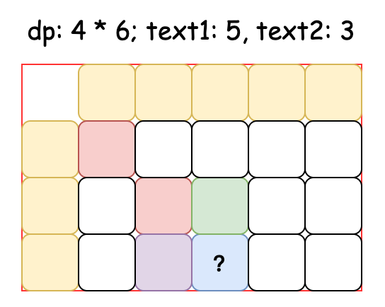

**刷前必读**：[学算法要读《算法导论》吗？](https://blog.csdn.net/qq_46225886/article/details/136286109)

## 双指针

- 相关学习：[关于双指针算法问题的思考](https://juejin.cn/post/7292631628652183602)

### 数组

| 题目链接                                                                                                                  | 题解                                                                          | 备注 |
|-----------------------------------------------------------------------------------------------------------------------|-----------------------------------------------------------------------------|----|
| [26. 删除有序数组中的重复项 简单](https://leetcode.cn/problems/remove-duplicates-from-sorted-array/)                               | [Solution26.java](src%2Fleetcode%2Fdoublepointer%2FSolution26.java)         | ✅  |
| [392. 判断子序列 简单](https://leetcode.cn/problems/is-subsequence/)                                                         | [Solution392.java](src%2Fleetcode%2Fdoublepointer%2FSolution392.java)       | ✅  |
| [27. 移除元素 简单](https://leetcode.cn/problems/remove-element/)                                                           | [Solution27.java](src%2Fleetcode%2Fdoublepointer%2FSolution27.java)         | ✅  |
| [LCR 139. 训练计划 I 简单](https://leetcode.cn/problems/diao-zheng-shu-zu-shun-xu-shi-qi-shu-wei-yu-ou-shu-qian-mian-lcof/) | [SolutionLCR139.java](src%2Fleetcode%2Fdoublepointer%2FSolutionLCR139.java) | ✅  |
| [面试题 10.01. 合并排序的数组 简单](https://leetcode.cn/problems/sorted-merge-lcci/)                                              | [Interview1001.java](src%2Fleetcode%2Fdoublepointer%2FInterview1001.java)   | ✅  |
| [581. 最短无序连续子数组 中等](https://leetcode.cn/problems/shortest-unsorted-continuous-subarray/)                              | [Solution581.java](src%2Fleetcode%2Fdoublepointer%2FSolution581.java)       | ✅  |
| [11. 盛最多水的容器 中等](https://leetcode.cn/problems/container-with-most-water/)                                             | [Solution11.java](src%2Fleetcode%2Fdoublepointer%2FSolution11.java)         | ✅  |
| [881. 救生艇 中等](https://leetcode.cn/problems/boats-to-save-people/)                                                     | [Solution881.java](src%2Fleetcode%2Fdoublepointer%2FSolution881.java)       | ✅  |
| [870. 优势洗牌 中等](https://leetcode.cn/problems/advantage-shuffle/)                                                       | [Solution870.java](src%2Fleetcode%2Fdoublepointer%2FSolution870.java)       | ✅  |
| [658. 找到 K 个最接近的元素 中等](https://leetcode.cn/problems/find-k-closest-elements/)                                         | [Solution658.java](src%2Fleetcode%2Fdoublepointer%2FSolution658.java)       |    |
| [825. 适龄的朋友 中等](https://leetcode.cn/problems/friends-of-appropriate-ages/)                                            | [Solution825.java](src%2Fleetcode%2Fdoublepointer%2FSolution825.java)       |    |
| [56. 合并区间 中等](https://leetcode.cn/problems/merge-intervals/)                                                          | [Solution56.java](src%2Fleetcode%2Fdoublepointer%2FSolution56.java)         | ✅  |
| [413. 等差数列划分 中等](https://leetcode.cn/problems/arithmetic-slices/)                                                     | [Solution413.java](src%2Fleetcode%2Fslidingwindow%2FSolution413.java)       |    |
| [167. 两数之和 II - 输入有序数组 中等](https://leetcode.cn/problems/two-sum-ii-input-array-is-sorted/)                            | [Solution167.java](src%2Fleetcode%2Fdoublepointer%2FSolution167.java)       |    |
| [15. 三数之和 中等](https://leetcode.cn/problems/3sum/)                                                                     | [Solution15.java](src%2Fleetcode%2Fdoublepointer%2FSolution15.java)         |    |
| [16. 最接近的三数之和 中等](https://leetcode.cn/problems/3sum-closest/)                                                         | [Solution16.java](src%2Fleetcode%2Fdoublepointer%2FSolution16.java)         |    |
| [18. 四数之和 中等](https://leetcode.cn/problems/4sum/)                                                                     | [Solution18.java](src%2Fleetcode%2Fdoublepointer%2FSolution18.java)         |    |

### 字符串

| 题目链接                                                                                                  | 题解                                                                        | 备注                                        |
|-------------------------------------------------------------------------------------------------------|---------------------------------------------------------------------------|-------------------------------------------|
| [125. 验证回文串 简单](https://leetcode.cn/problems/valid-palindrome/)                                       | [Solution125.java](src%2Fleetcode%2Fdoublepointer%2FSolution125.java)     | ✅Character.isLetterOrDigit() 静态方法判断是字母和数字 |
| [面试题 17.11. 单词距离 中等](https://leetcode.cn/problems/find-closest-lcci/)                                 | [Interview1711.java](src%2Fleetcode%2Fdoublepointer%2FInterview1711.java) | ✅                                         |
| [809. 情感丰富的文字 中等](https://leetcode.cn/problems/expressive-words/)                                     | [Solution809.java](src%2Fleetcode%2Fdoublepointer%2FSolution809.java)     | ✅                                         |
| [443. 压缩字符串 中等](https://leetcode.cn/problems/string-compression/)                                     | [Solution443.java](src%2Fleetcode%2Fdoublepointer%2FSolution443.java)     | ✅                                         |
| [481. 神奇字符串 中等](https://leetcode.cn/problems/magical-string/)                                         | [Solution481.java](src%2Fleetcode%2Fdoublepointer%2FSolution481.java)     | ✅                                         |
| [524. 通过删除字母匹配到字典里最长单词 中等](https://leetcode.cn/problems/longest-word-in-dictionary-through-deleting/) | [Solution524.java](src%2Fleetcode%2Fdoublepointer%2FSolution524.java)     | ✅                                         |
| [777. 在LR字符串中交换相邻字符 中等](https://leetcode.cn/problems/swap-adjacent-in-lr-string/)                     | [Solution777.java](src%2Fleetcode%2Fdoublepointer%2FSolution777.java)     |                                           |
| [838. 推多米诺 中等](https://leetcode.cn/problems/push-dominoes/)                                           | [Solution838.java](src%2Fleetcode%2Fdoublepointer%2FSolution838.java)     | ✅                                         |
| [面试题 01.05. 一次编辑 中等](https://leetcode.cn/problems/one-away-lcci/)                                     | [Interview0105.java](src%2Fleetcode%2Fdoublepointer%2FInterview0105.java) |                                           |

## 滑动窗口

- 相关学习：[滑动窗口算法技巧](https://juejin.cn/post/7287907234704162828)

### 固定窗口

| 题目链接                                                                                                          | 题解                                                                      | 备注 |
|---------------------------------------------------------------------------------------------------------------|-------------------------------------------------------------------------|----|
| [643. 子数组最大平均数 I 简单](https://leetcode.cn/problems/maximum-average-subarray-i/)                                | [Solution643.java](src%2Fleetcode%2Fsegmenttree%2FSolution643.java)     |    |
| [1423. 可获得的最大点数 中等](https://leetcode.cn/problems/maximum-points-you-can-obtain-from-cards/)                   | [Solution1423.java](src%2Fleetcode%2Fslidingwindow%2FSolution1423.java) |    |
| [1984. 学生分数的最小差值 简单](https://leetcode.cn/problems/minimum-difference-between-highest-and-lowest-of-k-scores/) | [Solution1984.java](src%2Fleetcode%2Fslidingwindow%2FSolution1984.java) |    |
| [438. 找到字符串中所有字母异位词 中等](https://leetcode.cn/problems/find-all-anagrams-in-a-string/)                          | [Solution438.java](src%2Fleetcode%2Fslidingwindow%2FSolution438.java)   |    |
| [567. 字符串的排列 中等](https://leetcode.cn/problems/permutation-in-string/)                                         | [Solution567.java](src%2Fleetcode%2Fslidingwindow%2FSolution567.java)   |    |
| [1052. 爱生气的书店老板 中等](https://leetcode.cn/problems/grumpy-bookstore-owner/)                                     | [Solution1052.java](src%2Fleetcode%2Fslidingwindow%2FSolution1052.java) |    |

### 动态窗口

| 题目链接                                                                                                      | 题解                                                                            | 备注                       |
|-----------------------------------------------------------------------------------------------------------|-------------------------------------------------------------------------------|--------------------------|
| [剑指 Offer 57 - II. 和为s的连续正数序列 简单](https://leetcode.cn/problems/he-wei-sde-lian-xu-zheng-shu-xu-lie-lcof/) | [SolutionOffer57.java](src%2Fleetcode%2Fslidingwindow%2FSolutionOffer57.java) |                          |
| [1446. 连续字符 简单](https://leetcode.cn/problems/consecutive-characters/)                                     | [Solution1446.java](src%2Fleetcode%2Fslidingwindow%2FSolution1446.java)       |                          |
| [LCR 008. 长度最小的子数组 中等](https://leetcode.cn/problems/2VG8Kg/)                                              | [SolutionLCR008.java](src%2Fleetcode%2Fslidingwindow%2FSolutionLCR008.java)   |                          |
| [76. 最小覆盖子串 困难](https://leetcode.cn/problems/minimum-window-substring/)                                   | [Solution76.java](src%2Fleetcode%2Fslidingwindow%2FSolution76.java)           |                          |
| [713. 乘积小于 K 的子数组 中等](https://leetcode.cn/problems/subarray-product-less-than-k/)                         | [Solution713.java](src%2Fleetcode%2Fslidingwindow%2FSolution713.java)         | 固定右端点的子数组数量为以该右端点结尾的数组长度 |
| [992. K 个不同整数的子数组 困难](https://leetcode.cn/problems/subarrays-with-k-different-integers/)                  | [Solution992.java](src%2Fleetcode%2Fslidingwindow%2FSolution992.java)         | ⭐️                       |
| [3. 无重复字符的最长子串 中等](https://leetcode.cn/problems/longest-substring-without-repeating-characters/)          | [Solution3.java](src%2Fleetcode%2Fslidingwindow%2FSolution3.java)             |                          |
| [1759. 统计同质子字符串的数目 中等](https://leetcode.cn/problems/count-number-of-homogenous-substrings/)               | [Solution1759.java](src%2Fleetcode%2Fslidingwindow%2FSolution1759.java)       |                          |
| [1695. 删除子数组的最大得分 中等](https://leetcode.cn/problems/maximum-erasure-value/)                                | [Solution1695.java](src%2Fleetcode%2Fslidingwindow%2FSolution1695.java)       |                          |
| [1004. 最大连续1的个数 III 中等](https://leetcode.cn/problems/max-consecutive-ones-iii/)                           | [Solution1004.java](src%2Fleetcode%2Fslidingwindow%2FSolution1004.java)       |                          |
| [1208. 尽可能使字符串相等 中等](https://leetcode.cn/problems/get-equal-substrings-within-budget/)                    | [Solution1208.java](src%2Fleetcode%2Fslidingwindow%2FSolution1208.java)       |                          |
| [904. 水果成篮 中等](https://leetcode.cn/problems/fruit-into-baskets/)                                          | [Solution904.java](src%2Fleetcode%2Fslidingwindow%2FSolution904.java)         |                          |
| [424. 替换后的最长重复字符 中等](https://leetcode.cn/problems/longest-repeating-character-replacement/)               | [Solution424.java](src%2Fleetcode%2Fslidingwindow%2FSolution424.java)         |                          |
| [2024. 考试的最大困扰度 中等](https://leetcode.cn/problems/maximize-the-confusion-of-an-exam/)                      | [Solution2024.java](src%2Fleetcode%2Fslidingwindow%2FSolution2024.java)       |                          |

## 二分查找

- 相关学习：[二分查找是偏爱细节的魔鬼](https://juejin.cn/post/7284158980112400419)

### 数组有序

| 题目链接                                                                                                                  | 题解                                                                               | 备注                   |
|-----------------------------------------------------------------------------------------------------------------------|----------------------------------------------------------------------------------|----------------------|
| [704. 二分查找 简单](https://leetcode.cn/problems/binary-search/)                                                           | [Solution704.java](src%2Fleetcode%2Fbinarysearch%2FSolution704.java)             |                      |
| [35. 搜索插入位置 简单](https://leetcode.cn/problems/search-insert-position/)                                                 | [Solution35.java](src%2Fleetcode%2Fbinarysearch%2FSolution35.java)               |                      |
| [744. 寻找比目标字母大的最小字母 简单](https://leetcode.cn/problems/find-smallest-letter-greater-than-target/)                       | [Solution744.java](src%2Fleetcode%2Fbinarysearch%2FSolution744.java)             |                      |
| [367. 有效的完全平方数 简单](https://leetcode.cn/problems/valid-perfect-square/)                                                | [Solution367.java](src%2Fleetcode%2Fbinarysearch%2FSolution367.java)             |                      |
| [34. 在排序数组中查找元素的第一个和最后一个位置 中等](https://leetcode.cn/problems/find-first-and-last-position-of-element-in-sorted-array/) | [Solution34.java](src%2Fleetcode%2Fbinarysearch%2FSolution34.java)               |                      |
| [74. 搜索二维矩阵 中等](https://leetcode.cn/problems/search-a-2d-matrix/)                                                     | [Solution74.java](src%2Fleetcode%2Fbinarysearch%2FSolution74.java)               |                      |
| [240. 搜索二维矩阵 II 中等](https://leetcode.cn/problems/search-a-2d-matrix-ii/)                                              | [Solution240.java](src%2Fleetcode%2Fbinarysearch%2FSolution240.java)             |                      |
| [268. 丢失的数字 简单](https://leetcode.cn/problems/missing-number/)                                                         | [Solution268.java](src%2Fleetcode%2Fbinarysearch%2FSolution268.java)             |                      |
| [剑指 Offer 53 - II. 0～n-1中缺失的数字 简单](https://leetcode.cn/problems/que-shi-de-shu-zi-lcof/)                              | [SolutionOffer532.java](src%2Fleetcode%2Fbinarysearch%2FSolutionOffer532.java)   | 二分查找两段性的典型应用         |
| [436. 寻找右区间 中等](https://leetcode.cn/problems/find-right-interval/)                                                    | [Solution436.java](src%2Fleetcode%2Fbinarysearch%2FSolution436.java)             |                      |
| [532. 数组中的 k-diff 数对 中等](https://leetcode.cn/problems/k-diff-pairs-in-an-array/)                                      | [Solution532.java](src%2Fleetcode%2Fbinarysearch%2FSolution532.java)             |                      |
| [911. 在线选举 中等](https://leetcode.cn/problems/online-election/)                                                         | [TopVotedCandidate.java](src%2Fleetcode%2Fbinarysearch%2FTopVotedCandidate.java) | ⭐️                   |
| [1608. 特殊数组的特征值 简单](https://leetcode.cn/problems/special-array-with-x-elements-greater-than-or-equal-x/)              | [Solution1608.java](src%2Fleetcode%2Fbinarysearch%2FSolution1608.java)           |                      |
| [1818. 绝对差值和 中等](https://leetcode.cn/problems/minimum-absolute-sum-difference/)                                       | [Solution1818.java](src%2Fleetcode%2Fbinarysearch%2FSolution1818.java)           |                      |
| [33. 搜索旋转排序数组 中等](https://leetcode.cn/problems/search-in-rotated-sorted-array/)                                       | [Solution33.java](src%2Fleetcode%2Fbinarysearch%2FSolution33.java)               | ️                    |
| [153. 寻找旋转排序数组中的最小值 中等](https://leetcode.cn/problems/find-minimum-in-rotated-sorted-array/)                           | [Solution153.java](src%2Fleetcode%2Fbinarysearch%2FSolution153.java)             |                      |
| [81. 搜索旋转排序数组 II 中等](https://leetcode.cn/problems/search-in-rotated-sorted-array-ii/)                                 | [Solution81.java](src%2Fleetcode%2Fbinarysearch%2FSolution81.java)               |                      |
| [154. 寻找旋转排序数组中的最小值 II 困难](https://leetcode.cn/problems/find-minimum-in-rotated-sorted-array-ii/)                     | [Solution154.java](src%2Fleetcode%2Fbinarysearch%2FSolution154.java)             |                      |
| [1005. K 次取反后最大化的数组和 简单](https://leetcode.cn/problems/maximize-sum-of-array-after-k-negations/)                       | [Solution1005.java](src%2Fleetcode%2Fbinarysearch%2FSolution1005.java)           | left指针表示小于被查找值的数量的应用 |

### 数组无序

查找峰值是非常典型的根据数据二段性进行二分的题目

| 题目链接                                                                              | 题解                                                                   | 备注  |
|-----------------------------------------------------------------------------------|----------------------------------------------------------------------|-----|
| [162. 寻找峰值 中等](https://leetcode.cn/problems/find-peak-element/)                   | [Solution162.java](src%2Fleetcode%2Fbinarysearch%2FSolution162.java) | ⭐️  |
| [852. 山脉数组的峰顶索引 中等](https://leetcode.cn/problems/peak-index-in-a-mountain-array/) | [Solution852.java](src%2Fleetcode%2Fbinarysearch%2FSolution852.java) |     |

### 贪心算法

| 题目链接                                                                                                       | 题解                                                                                       | 备注                         |
|------------------------------------------------------------------------------------------------------------|------------------------------------------------------------------------------------------|----------------------------|
| [1760. 袋子里最少数目的球 中等](https://leetcode.cn/problems/minimum-limit-of-balls-in-a-bag/)                        | [Solution1760.java](src%2Fleetcode%2Fbinarysearch%2Fgreedyalgorithm%2FSolution1760.java) |                            |
| [875. 爱吃香蕉的珂珂 中等](https://leetcode.cn/problems/koko-eating-bananas/)                                       | [Solution875.java](src%2Fleetcode%2Fbinarysearch%2Fgreedyalgorithm%2FSolution875.java)   |                            |
| [2226. 每个小孩最多能分到多少糖果 中等](https://leetcode.cn/problems/maximum-candies-allocated-to-k-children/)            | [Solution2226.java](src%2Fleetcode%2Fbinarysearch%2Fgreedyalgorithm%2FSolution2226.java) |                            |
| [1011. 在 D 天内送达包裹的能力 中等](https://leetcode.cn/problems/capacity-to-ship-packages-within-d-days/)            | [Solution1011.java](src%2Fleetcode%2Fbinarysearch%2Fgreedyalgorithm%2FSolution1011.java) |                            |
| [410. 分割数组的最大值 困难](https://leetcode.cn/problems/split-array-largest-sum/)                                  | [Solution410.java](src%2Fleetcode%2Fbinarysearch%2Fgreedyalgorithm%2FSolution410.java)   |                            |
| [1552. 两球之间的磁力 中等](https://leetcode.cn/problems/magnetic-force-between-two-balls/)                         | [Solution1552.java](src%2Fleetcode%2Fbinarysearch%2Fgreedyalgorithm%2FSolution1552.java) |                            |
| [475. 供暖器 中等](https://leetcode.cn/problems/heaters/)                                                       | [Solution475.java](src%2Fleetcode%2Fbinarysearch%2Fgreedyalgorithm%2FSolution475.java)   |                            |
| [1802. 有界数组中指定下标处的最大值 中等](https://leetcode.cn/problems/maximum-value-at-a-given-index-in-a-bounded-array/) | [Solution1802.java](src%2Fleetcode%2Fbinarysearch%2Fgreedyalgorithm%2FSolution1802.java) | 等差数列求和公式：（首项 + 尾项）* 项数 / 2 |
| [719. 找出第 K 小的数对距离 困难](https://leetcode.cn/problems/find-k-th-smallest-pair-distance/)                     | [Solution719.java](src%2Fleetcode%2Fbinarysearch%2Fgreedyalgorithm%2FSolution719.java)   |                            |
| [668. 乘法表中第k小的数 困难](https://leetcode.cn/problems/kth-smallest-number-in-multiplication-table/)             | [Solution668.java](src%2Fleetcode%2Fbinarysearch%2Fgreedyalgorithm%2FSolution668.java)   |                            |

## 前缀和

前缀和表示数组的前 n 项和，它是一种数据预处理的方法，是对空间换时间的应用，我们一般会创建 **数组长度 + 1** 大小的数组来记录前缀和，并将 0 索引处的前缀和标记为 0，表示前 0 项和，如下图所示，索引 1 处的前缀和表示原数组中的前 1 项和（nums[0]），所以我们想获取原数组中某索引元素的前缀和的话，需要将索引值加 1 再从前缀和数组中取值。


一般 **连续子数组** 求和且不涉及区间修改的问题都可以使用前缀和来求解，通过 **前缀和减法计算** 我们能计算出任意区间和，这一点很重要，利用这一点可以解决很多区间求和的问题。

- 一维数组前缀和计算模板如下：

```java
    int[] preSum = new int[nums.length + 1];
    for (int i = 1; i < preSum.length; i++) {
        preSum[i] = preSum[i - 1] + nums[i - 1];
    }
```

### 一维数组前缀和

| 题目链接                                                                                                                 | 题解                                                                  | 备注 |
|----------------------------------------------------------------------------------------------------------------------|---------------------------------------------------------------------|----|
| [1894. 找到需要补充粉笔的学生编号 中等](https://leetcode.cn/problems/find-the-student-that-will-replace-the-chalk/)                 | [Solution1894.java](src%2Fleetcode%2Fprefixsum%2FSolution1894.java) |    |
| [1744. 你能在你最喜欢的那天吃到你最喜欢的糖果吗？ 中等](https://leetcode.cn/problems/can-you-eat-your-favorite-candy-on-your-favorite-day/) | [Solution1744.java](src%2Fleetcode%2Fprefixsum%2FSolution1744.java) |    |
| [497. 非重叠矩形中的随机点 中等](https://leetcode.cn/problems/random-point-in-non-overlapping-rectangles/)                       | [Solution497.java](src%2Fleetcode%2Fprefixsum%2FSolution497.java)   |    |
| [528. 按权重随机选择 中等](https://leetcode.cn/problems/random-pick-with-weight/)                                             | [Solution528.java](src%2Fleetcode%2Fprefixsum%2FSolution528.java)   |    |
| [238. 除自身以外数组的乘积 中等](https://leetcode.cn/problems/product-of-array-except-self/)                                     | [Solution238.java](src%2Fleetcode%2Fprefixsum%2FSolution238.java)   |    |

#### 前缀和减法计算任意区间和

我们能通过前缀和减法计算任意区间和，即 `preSum[k, i] = preSum[0, i] - preSum[0, k - 1]`，其中 k <= i

| 题目链接                                                                                    | 题解                                                                          | 备注                                                  |
|-----------------------------------------------------------------------------------------|-----------------------------------------------------------------------------|-----------------------------------------------------|
| [303. 区域和检索 - 数组不可变 简单](https://leetcode.cn/problems/range-sum-query-immutable/)        | [NumArray.java](src%2Fleetcode%2Fprefixsum%2FNumArray.java)                 |                                                     |
| [724. 寻找数组的中心下标 简单](https://leetcode.cn/problems/find-pivot-index/)                     | [Solution724.java](src%2Fleetcode%2Fprefixsum%2FSolution724.java)           |                                                     |
| [1588. 所有奇数长度子数组的和 简单](https://leetcode.cn/problems/sum-of-all-odd-length-subarrays/)   | [Solution1588.java](src%2Fleetcode%2Fprefixsum%2FSolution1588.java)         |                                                     |
| [1652. 拆炸弹 简单](https://leetcode.cn/problems/defuse-the-bomb/)                           | [Solution1652.java](src%2Fleetcode%2Fprefixsum%2FSolution1652.java)         |                                                     |
| [1310. 子数组异或查询 中等](https://leetcode.cn/problems/xor-queries-of-a-subarray/)             | [Solution1310.java](src%2Fleetcode%2Fbinaryindexedtree%2FSolution1310.java) |                                                     |
| [525. 连续数组 中等](https://leetcode.cn/problems/contiguous-array/)                          | [Solution525.java](src%2Fleetcode%2Fprefixsum%2FSolution525.java)           | 本题技巧性比较强，思路是将 0 看成 -1，并找到相等的前缀和后计算最长的数组长度，本质上是前缀和减法 |
| [560. 和为 K 的子数组 中等](https://leetcode.cn/problems/subarray-sum-equals-k/)                | [Solution560.java](src%2Fleetcode%2Fprefixsum%2FSolution560.java)           | ⭐️                                                  |
| [396. 旋转函数 中等](https://leetcode.cn/problems/rotate-function/)                           | [Solution396.java](src%2Fleetcode%2Fprefixsum%2FSolution396.java)           |                                                     |
| [523. 连续的子数组和 中等](https://leetcode.cn/problems/continuous-subarray-sum/)                | [Solution523.java](src%2Fleetcode%2Fprefixsum%2FSolution523.java)           |                                                     |
| [926. 将字符串翻转到单调递增 中等](https://leetcode.cn/problems/flip-string-to-monotone-increasing/) | [Solution926.java](src%2Fleetcode%2Fprefixsum%2FSolution926.java)           |                                                     |
| [2055. 蜡烛之间的盘子 中等](https://leetcode.cn/problems/plates-between-candles/)                | [Solution2055.java](src%2Fleetcode%2Fprefixsum%2FSolution2055.java)         |                                                     |

### 二维数组前缀和

我觉得 304 题是二维数组前缀和的代表性题目，熟悉它的解题思路之后，大概几分钟就能解出来。我们以计算 `matrix[i][j]` 处的前缀和为例，其中二维数组中每个元素表示以 `[0, 0]` 为左上角，以当前元素 `[i, j]` 为右下角构成的矩阵的前缀和，在计算 `matrix[i][j]` 之前，我们先来看一下官方题解给出示例图，我觉得记住这张图能的推导出计算公式：


计算 `matrix[i][j]` 我们能够依靠已知的前缀和 `matrix[i - 1][j - 1]`、`matrix[i - 1][j]` 和 `matrix[i][j - 1]`，其实我们可以轻易的根据图示得出 `matrix[i][j] = matrix[i - 1][j] + matrix[i][j - 1] - matrix[i - 1][j - 1]`，为什么要减去 `matrix[i - 1][j - 1]` 呢，因为在 `matrix[i - 1][j]` 和 `matrix[i][j - 1]` 中都包含着 `matrix[i - 1][j - 1]`，我们做加和计算时把 `matrix[i - 1][j - 1]` 加了两遍，所以需要再减去一个，记住这个图示之后遇到类似的题推导一下就可以了，不必记住模板。

计算二维数组前缀和的要点一定是确定好 **矩形的对角（左上角和右下角 或 左下角和右上角）**

| 题目链接                                                                                  | 题解                                                                         | 备注 |
|---------------------------------------------------------------------------------------|----------------------------------------------------------------------------|----|
| [304. 二维区域和检索 - 矩阵不可变 中等](https://leetcode.cn/problems/range-sum-query-2d-immutable/) | [NumMatrix.java](src%2Fleetcode%2Fprefixsum%2FNumMatrix.java)              |    |
| [661. 图片平滑器 简单](https://leetcode.cn/problems/image-smoother/)                         | [Solution661.java](src%2Fleetcode%2Fprefixsum%2Fmatrix%2FSolution661.java) |    |

## 差分

## 树状数组

相关学习：[深入理解树状数组](https://juejin.cn/post/7271862751957909523)

树状数组是一种简单的数据结构，它支持单点修改和区间查询操作，一般的 RMQ 问题优先选择树状数组求解，而不是线段树，后者相对来说代码量大，也比较复杂

- 树状数组解题模板：[BinaryIndexedTree.java](src%2Fleetcode%2Fbinaryindexedtree%2FBinaryIndexedTree.java)

| 题目链接                                                                           | 题解                                                                          | 备注 |
|--------------------------------------------------------------------------------|-----------------------------------------------------------------------------|----|
| [307. 区域和检索 - 数组可修改 中等](https://leetcode.cn/problems/range-sum-query-mutable/) | [NumArray.java](src%2Fleetcode%2Fbinaryindexedtree%2FNumArray.java)         |    |
| [1395. 统计作战单位数 中等](https://leetcode.cn/problems/count-number-of-teams/)        | [Solution1395.java](src%2Fleetcode%2Fbinaryindexedtree%2FSolution1395.java) | ⭐️ |
| [2179. 统计数组中好三元组数目 困难](https://leetcode.cn/problems/count-number-of-teams/)    | [Solution2179.java](src%2Fleetcode%2Fbinaryindexedtree%2FSolution2179.java) |    |
| [775. 全局倒置与局部倒置 中等](https://leetcode.cn/problems/global-and-local-inversions/) | [Solution775.java](src%2Fleetcode%2Fbinaryindexedtree%2FSolution775.java)   |    |
| [327. 区间和的个数 困难](https://leetcode.cn/problems/count-of-range-sum/)             | [Solution327.java](src%2Fleetcode%2Fbinaryindexedtree%2FSolution327.java)   |    |

## 线段树

相关学习：[深入理解线段树](https://juejin.cn/post/7274847103729516584)

线段树可以解决区间和、区间最大值或区间最小值的问题（RMQ 问题），不过线段树的代码量相对来说较大而且比较复杂，所以线段树是在前缀和、差分和树状数组解决方法之后不得已才会考虑的方案。
一般使用线段树的题目都具备 **区间修改和区间查询** 的特点，如果大家在这里是按照顺序刷的话，应该对 RMQ 问题有一个比较充分的了解了，在这里做一下相关题型解法的归纳：

- 数组不变，区间查询：前缀和、树状数组和线段树
- 数组单点修改，区间查询：树状数组和线段树
- 数组区间修改，单点查询：差分和线段树
- 数组区间修改，区间查询：线段树

注意每种题型涉及的解法都是越靠前越优先考虑。

### 单点修改和区间查询

- 线段树模板：[SegmentTree.java](src%2Fleetcode%2Fsegmenttree%2FSegmentTree.java)

| 题目链接                                                                                                       | 题解                                                                    | 备注 |
|------------------------------------------------------------------------------------------------------------|-----------------------------------------------------------------------|----|
| [307. 区域和检索 - 数组可修改 中等](https://leetcode.cn/problems/range-sum-query-mutable/)                             | [NumArray.java](src%2Fleetcode%2Fsegmenttree%2FNumArray.java)         |    |
| [239. 滑动窗口最大值 困难](https://leetcode.cn/problems/sliding-window-maximum/)                                    | [Solution239.java](src%2Fleetcode%2Fsegmenttree%2FSolution239.java)   |    |
| [654. 最大二叉树 中等](https://leetcode.cn/problems/maximum-binary-tree/)                                         | [Solution654.java](src%2Fleetcode%2Fsegmenttree%2FSolution654.java)   |    |

### 区间修改

- 线段树模板：[SegmentTree2.java](src%2Fleetcode%2Fsegmenttree%2FSegmentTree2.java)

| 题目链接                                                                                                       | 题解                                                                    | 备注 |
|------------------------------------------------------------------------------------------------------------|-----------------------------------------------------------------------|----|
| [1893. 检查是否区域内所有整数都被覆盖 简单](https://leetcode.cn/problems/check-if-all-the-integers-in-a-range-are-covered/) | [Solution1893.java](src%2Fleetcode%2Fsegmenttree%2FSolution1893.java) |    |
| [1109. 航班预订统计 中等](https://leetcode.cn/problems/corporate-flight-bookings/)                                 | [Solution1109.java](src%2Fleetcode%2Fsegmenttree%2FSolution1109.java) |    |

### 动态开点

- 线段树模版：[SegmentTree3.java](src%2Fleetcode%2Fsegmenttree%2FSegmentTree3.java)

| 题目链接                                                                 | 题解                                                                          | 备注                             |
|----------------------------------------------------------------------|-----------------------------------------------------------------------------|--------------------------------|
| [729. 我的日程安排表 I 中等](https://leetcode.cn/problems/my-calendar-i/)     | [MyCalendar.java](src%2Fleetcode%2Fsegmenttree%2FMyCalendar.java)           |                                |
| [731. 我的日程安排表 II 中等](https://leetcode.cn/problems/my-calendar-ii/)   | [MyCalendarTwo.java](src%2Fleetcode%2Fsegmenttree%2FMyCalendarTwo.java)     | ⭐️                             |
| [732. 我的日程安排表 III 困难](https://leetcode.cn/problems/my-calendar-iii/) | [MyCalendarThree.java](src%2Fleetcode%2Fsegmenttree%2FMyCalendarThree.java) |                                |
| [715. Range 模块 困难](https://leetcode.cn/problems/range-module/)       | [RangeModule.java](src%2Fleetcode%2Fsegmenttree%2FRangeModule.java)         | ✅️ 理解 add 是作为区间变化量还是区间内单个值的变化量 |

## 字符串

| 题目链接                                                                                                                    | 题解                                                              | 备注                                 |
|-------------------------------------------------------------------------------------------------------------------------|-----------------------------------------------------------------|------------------------------------|
| [14. 最长公共前缀 简单](https://leetcode.cn/problems/longest-common-prefix/)                                                    | [Solution14.java](src%2Fleetcode%2Fstr%2FSolution14.java)       |                                    |
| [1455. 检查单词是否为句中其他单词的前缀 简单](https://leetcode.cn/problems/check-if-a-word-occurs-as-a-prefix-of-any-word-in-a-sentence/) | [Solution1455.java](src%2Fleetcode%2Fstr%2FSolution1455.java)   | startsWith() 方法                    |
| [187. 重复的DNA序列 中等](https://leetcode.cn/problems/repeated-dna-sequences/)                                                | [Solution187.java](src%2Fleetcode%2Fstr%2FSolution187.java)     |                                    |
| [面试题 10.02. 变位词组 中等](https://leetcode.cn/problems/group-anagrams-lcci/)                                                 | [Interview1002.java](src%2Fleetcode%2Fstr%2FInterview1002.java) |                                    |
| [394. 字符串解码 中等](https://leetcode.cn/problems/group-anagrams-lcci/)                                                      | [Solution394.java](src%2Fleetcode%2Fstr%2FSolution394.java)     |                                    |
| [151. 反转字符串中的单词 中等](https://leetcode.cn/problems/reverse-words-in-a-string/)                                            | [Solution151.java](src%2Fleetcode%2Fstr%2FSolution151.java)     |                                    |
| [165. 比较版本号 中等](https://leetcode.cn/problems/compare-version-numbers/)                                                  | [Solution165.java](src%2Fleetcode%2Fstr%2FSolution165.java)     | `Integer.parseInt()` 字符串转整数自动忽略前导0 |
| [8. 字符串转换整数 (atoi) 中等](https://leetcode.cn/problems/string-to-integer-atoi/)                                            | [Solution8.java](src%2Fleetcode%2Fstr%2FSolution8.java)         | ⭐️数字边界问题处理                         |
| [43. 字符串相乘 中等](https://leetcode.cn/problems/multiply-strings/)                                                          | [Solution43.java](src%2Fleetcode%2Fstr%2FSolution43.java)       |                                    |
| [6. Z 字形变换 中等](https://leetcode.cn/problems/zigzag-conversion/)                                                         | [Solution6.java](src%2Fleetcode%2Fstr%2FSolution6.java)         |                                    |

## 链表

链表是一种 **递归** 的数据结构，与数组不同的是它不需要占用连续的内存空间，但是需要额外的空间保存后继节点的指针，以此将所有的链表节点串联起来。它的删除和插入操作比较高效，时间复杂度为 $O(1)$，但是想访问链表中某个值时，需要对链表进行遍历，时间复杂度为 $O(n)$。**链表是数组的一种重要的替代方式**。

### 链表反转

```java
    public ListNode reverseList(ListNode head) {
        ListNode pre = null;

        while (head != null) {
            ListNode temp = head.next;
            head.next = pre;
            pre = head;
            head = temp;
        }

        return pre;
    }
```

| 题目链接                                                                       | 题解                                                                 | 备注       |
|----------------------------------------------------------------------------|--------------------------------------------------------------------|----------|
| [206. 反转链表 简单](https://leetcode.cn/problems/reverse-linked-list/)          | [Solution206.java](src%2Fleetcode%2Flinkedlist%2FSolution206.java) |          |
| [234. 回文链表 简单](https://leetcode.cn/problems/palindrome-linked-list/)       | [Solution234.java](src%2Fleetcode%2Flinkedlist%2FSolution234.java) | 快慢指针分开链表 |
| [92. 反转链表 II 中等](https://leetcode.cn/problems/reverse-linked-list-ii/)     | [Solution92.java](src%2Fleetcode%2Flinkedlist%2FSolution92.java)   |          |
| [25. K 个一组翻转链表 困难](https://leetcode.cn/problems/reverse-nodes-in-k-group/) | [Solution25.java](src%2Fleetcode%2Flinkedlist%2FSolution25.java)   |          |

### 递归

| 题目链接                                                                                                 | 题解                                                                         | 备注                          |
|------------------------------------------------------------------------------------------------------|----------------------------------------------------------------------------|-----------------------------|
| [剑指 Offer 06. 从尾到头打印链表 简单](https://leetcode.cn/problems/cong-wei-dao-tou-da-yin-lian-biao-lcof/)     | [SolutionOffer06.java](src%2Fleetcode%2Flinkedlist%2FSolutionOffer06.java) |                             |
| [剑指 Offer 35. 复杂链表的复制 中等](https://leetcode.cn/problems/fu-za-lian-biao-de-fu-zhi-lcof/)              | [SolutionOffer35.java](src%2Fleetcode%2Flinkedlist%2FSolutionOffer35.java) |                             |
| [24. 两两交换链表中的节点 中等](https://leetcode.cn/problems/swap-nodes-in-pairs/)                               | [Solution24.java](src%2Fleetcode%2Flinkedlist%2FSolution24.java)           |                             |
| [剑指 Offer 25. 合并两个排序的链表 简单](https://leetcode.cn/problems/he-bing-liang-ge-pai-xu-de-lian-biao-lcof/) | [SolutionOffer25.java](src%2Fleetcode%2Flinkedlist%2FSolutionOffer25.java) |                             |
| [23. 合并K个升序链表 困难](https://leetcode.cn/problems/merge-k-sorted-lists/)                                | [Solution23.java](src%2Fleetcode%2Flinkedlist%2FSolution23.java)           | 分治的思想(想想归并排序)               |
| [148. 排序链表 中等](https://leetcode.cn/problems/sort-list/)                                              | [Solution148.java](src%2Fleetcode%2Flinkedlist%2FSolution148.java)         | 也是分治的思想，但是它的难度是中等，其实和上一题差不多 |
| [430. 扁平化多级双向链表 中等](https://leetcode.cn/problems/flatten-a-multilevel-doubly-linked-list/)           | [Solution430.java](src%2Fleetcode%2Flinkedlist%2FSolution430.java)         |                             |
| [138. 随机链表的复制 中等](https://leetcode.cn/problems/copy-list-with-random-pointer/)                       | [Solution138.java](src%2Fleetcode%2Flinkedlist%2FSolution138.java)         |                             |

### 双指针、快慢指针

| 题目链接                                                                                                     | 题解                                                                         | 备注                                                                                          |
|----------------------------------------------------------------------------------------------------------|----------------------------------------------------------------------------|---------------------------------------------------------------------------------------------|
| [剑指 Offer 22. 链表中倒数第k个节点 简单](https://leetcode.cn/problems/lian-biao-zhong-dao-shu-di-kge-jie-dian-lcof/) | [SolutionOffer22.java](src%2Fleetcode%2Flinkedlist%2FSolutionOffer22.java) |                                                                                             |
| [876. 链表的中间结点 简单](https://leetcode.cn/problems/middle-of-the-linked-list/)                               | [Solution876.java](src%2Fleetcode%2Flinkedlist%2FSolution876.java)         |                                                                                             |
| [141. 环形链表 简单](https://leetcode.cn/problems/linked-list-cycle/)                                          | [Solution141.java](src%2Fleetcode%2Flinkedlist%2FSolution141.java)         |                                                                                             |
| [142. 环形链表 II 中等](https://leetcode.cn/problems/linked-list-cycle-ii/)                                    | [Solution142.java](src%2Fleetcode%2Flinkedlist%2FSolution142.java)         |                                                                                             |
| [287. 寻找重复数 中等](https://leetcode.cn/problems/find-the-duplicate-number/)                                 | [Solution287.java](src%2Fleetcode%2Flinkedlist%2FSolution287.java)         | ⭐️ 1. 如果提示 n + 1 个数，且数字范围在 `[1, n]` 内，那么可以使索引和该位置的值一致，来协助解题<br/> 2. 该题由于不能修改数组，所以转换成了环形链表求解 |
| [160. 相交链表 简单](https://leetcode.cn/problems/intersection-of-two-linked-lists/)                           | [Solution160.java](src%2Fleetcode%2Flinkedlist%2FSolution160.java)         |                                                                                             |

### 前驱节点在删除链表节点中的应用

| 题目链接                                                                                          | 题解                                                                         | 备注 |
|-----------------------------------------------------------------------------------------------|----------------------------------------------------------------------------|----|
| [剑指 Offer 18. 删除链表的节点 简单](https://leetcode.cn/problems/shan-chu-lian-biao-de-jie-dian-lcof/)  | [SolutionOffer18.java](src%2Fleetcode%2Flinkedlist%2FSolutionOffer18.java) |    |
| [83. 删除排序链表中的重复元素 简单](https://leetcode.cn/problems/remove-duplicates-from-sorted-list/)       | [Solution83.java](src%2Fleetcode%2Flinkedlist%2FSolution83.java)           |    |
| [82. 删除排序链表中的重复元素 II 中等](https://leetcode.cn/problems/remove-duplicates-from-sorted-list-ii/) | [Solution82.java](src%2Fleetcode%2Flinkedlist%2FSolution82.java)           |    |
| [19. 删除链表的倒数第 N 个结点 中等](https://leetcode.cn/problems/remove-nth-node-from-end-of-list/)       | [Solution19.java](src%2Fleetcode%2Flinkedlist%2FSolution19.java)           |    |
| [725. 分隔链表 中等](https://leetcode.cn/problems/split-linked-list-in-parts/)                      | [Solution725.java](src%2Fleetcode%2Flinkedlist%2FSolution725.java)         |    |
| [237. 删除链表中的节点 中等](https://leetcode.cn/problems/delete-node-in-a-linked-list/)                | [Solution237.java](src%2Fleetcode%2Flinkedlist%2FSolution237.java)         |    |

### 推导

| 题目链接                                                                    | 题解                                                                               | 备注 |
|-------------------------------------------------------------------------|----------------------------------------------------------------------------------|----|
| [328. 奇偶链表 中等](https://leetcode.cn/problems/odd-even-linked-list/)      | [Solution328.java](src%2Fleetcode%2Flinkedlist%2FSolution328.java)               |    |
| [382. 链表随机节点 中等](https://leetcode.cn/problems/linked-list-random-node/) | [Solution382.java](src%2Fleetcode%2Flinkedlist%2FSolution382.java)               |    |
| [剑指 Offer II 029. 排序的循环链表 中等](https://leetcode.cn/problems/4ueAj6/)     | [SolutionOfferTwo29.java](src%2Fleetcode%2Flinkedlist%2FSolutionOfferTwo29.java) |    |
| [面试题 02.05. 链表求和 中等](https://leetcode.cn/problems/sum-lists-lcci/)      | [Solution0205.java](src%2Fleetcode%2Flinkedlist%2FSolution0205.java)             |    |
| [445. 两数相加 II 中等](https://leetcode.cn/problems/add-two-numbers-ii/)     | [Solution445.java](src%2Fleetcode%2Flinkedlist%2FSolution445.java)               |    |
| [817. 链表组件 中等](https://leetcode.cn/problems/linked-list-components/)    | [Solution817.java](src%2Fleetcode%2Flinkedlist%2FSolution817.java)               |    |
| [86. 分隔链表 中等](https://leetcode.cn/problems/partition-list/)             | [Solution86.java](src%2Fleetcode%2Flinkedlist%2FSolution86.java)                 |    |

## 数据结构

| 题目链接                                                                              | 题解                                                                                                                                                              | 备注                                                                         |
|-----------------------------------------------------------------------------------|-----------------------------------------------------------------------------------------------------------------------------------------------------------------|----------------------------------------------------------------------------|
| [146. LRU 缓存 中等](https://leetcode.cn/problems/lru-cache/)                         | [LRUCache.java](src%2Fleetcode%2Fdatastructure%2FLRUCache.java) <br/> [LRUCacheLinkedHashMap.java](src%2Fleetcode%2Fdatastructure%2FLRUCacheLinkedHashMap.java) | [从 LinkedHashMap 源码到手撕 LRU 缓存](https://juejin.cn/post/7276698909782032440) |
| [460. LFU 缓存 困难](https://leetcode.cn/problems/lfu-cache/)                         | [LFUCache.java](src%2Fleetcode%2Fdatastructure%2FLFUCache.java)                                                                                                 | [手撕 LFU 缓存](https://juejin.cn/post/7279640340716519480)                    |
| [432. 全 O(1) 的数据结构 困难](https://leetcode.cn/problems/all-oone-data-structure/)     | [AllOne.java](src%2Fleetcode%2Fdatastructure%2FAllOne.java)                                                                                                     |                                                                            |
| [707. 设计链表 中等](https://leetcode.cn/problems/design-linked-list/)                  | [MyLinkedList.java](src%2Fleetcode%2Fdatastructure%2FMyLinkedList.java)                                                                                         |                                                                            |
| [641. 设计循环双端队列 中等](https://leetcode.cn/problems/design-circular-deque/)           | [MyCircularDeque.java](src%2Fleetcode%2Fdatastructure%2FMyCircularDeque.java)                                                                                   |                                                                            |
| [208. 实现 Trie (前缀树) 中等](https://leetcode.cn/problems/implement-trie-prefix-tree/) | [Trie.java](src%2Fleetcode%2Fdatastructure%2FTrie.java)                                                                                                         |                                                                            |
| [1206. 设计跳表 困难](https://leetcode.cn/problems/design-skiplist/)                    |                                                                                                                                                                 |                                                                            |

## 栈

栈是一种基于 **后进先出（LIFO）策略** 的集合类型，这就需要我们在对值进行处理时注意结果值有没有对顺序的要求，因为入栈到出栈是倒序的。

- 应用: 函数调用栈、括号的匹配、双栈实现浏览器的前进和后退功能、JVM栈、电子邮件的存放、算数表达式的求值(操作数栈和运算符栈)

| 题目链接                                                                                                     | 题解                                                                                          | 备注 |
|----------------------------------------------------------------------------------------------------------|---------------------------------------------------------------------------------------------|----|
| [20. 有效的括号 简单](https://leetcode.cn/problems/valid-parentheses/)                                          | [Solution20.java](src%2Fleetcode%2Fstack%2FSolution20.java)                                 |    |
| [232. 用栈实现队列 简单](https://leetcode.cn/problems/implement-queue-using-stacks/)                             | [MyQueue.java](src%2Fleetcode%2Fstack%2FMyQueue.java)                                       |    |
| [155. 最小栈 中等](https://leetcode.cn/problems/min-stack/)                                                   | [MinStack.java](src%2Fleetcode%2Fstack%2FMinStack.java)                                     |    |
| [946. 验证栈序列 中等](https://leetcode.cn/problems/validate-stack-sequences/)                                  | [Solution946.java](src%2Fleetcode%2Fstack%2FSolution946.java)                               |    |
| [71. 简化路径 中等](https://leetcode.cn/problems/simplify-path/)                                               | [Solution71.java](src%2Fleetcode%2Fstack%2FSolution71.java)                                 |    |
| [1190. 反转每对括号间的子串 中等](https://leetcode.cn/problems/reverse-substrings-between-each-pair-of-parentheses/) | [Solution1190.java](src%2Fleetcode%2Fstack%2FSolution1190.java)                             |    |
| [385. 迷你语法分析器 中等](https://leetcode.cn/problems/mini-parser/)                                             | [【宫水三叶】栈运用模拟题](https://leetcode.cn/problems/mini-parser/solutions/1422125/by-ac_oier-zuy6/) |    |
| [636. 函数的独占时间 中等](https://leetcode.cn/problems/exclusive-time-of-functions/)                             | [Solution636.java](src%2Fleetcode%2Fstack%2FSolution636.java)                               |    |
| [735. 行星碰撞 中等](https://leetcode.cn/problems/asteroid-collision/)                                         | [Solution735.java](src%2Fleetcode%2Fstack%2FSolution735.java)                               |    |
| [856. 括号的分数 中等](https://leetcode.cn/problems/score-of-parentheses/)                                      | [Solution856.java](src%2Fleetcode%2Fstack%2FSolution856.java)                               |    |
| [1106. 解析布尔表达式 困难](https://leetcode.cn/problems/parsing-a-boolean-expression/)                           | [Solution1106.java](src%2Fleetcode%2Fstack%2FSolution1106.java)                             |    |
| [32. 最长有效括号 困难](https://leetcode.cn/problems/longest-valid-parentheses/)                                 | [Solution32.java](src%2Fleetcode%2Fstack%2FSolution32.java)                                 |    |
| [726. 原子的数量 困难](https://leetcode.cn/problems/number-of-atoms/)                                           | [Solution726.java](src%2Fleetcode%2Fstack%2FSolution726.java)                               |    |

### 单调栈

单调栈本质上是 **维护数组中的元素为单调序列**，数组中的元素 **要么** 符合单调性顺利进栈，**要么** 不符合单调性而将栈中其他元素“挤走”再进栈，使得栈中序列始终满足单调性。

理解这一点很重要，我们以单调递增栈为例，如果出现了比栈顶元素 **小** 的值，即不符合当前栈中序列单增特性的值，那么它会使所有比它大的值出栈，而 **该值便是接下来要连续出栈元素右侧最近的小值**，比该值大的值出栈完毕后，该值进栈，使得栈中的序列仍然满足单调递增。

如果题目有 **在连续序列中找元素左/右侧最近的大/小值** 的特点，我们就可以使用单调栈来求解，找最近的小值的单调递增栈模板如下，注意入栈的是数组元素的索引而不是元素值：

```java
Stack<Integer> stack = new Stack<>();

for (int i = 0; i < nums.length; i++) {
    while (!stack.isEmpty() && nums[i] < nums[stack.peek()]) {
        int index = stack.pop();

        // 关于 index 的特殊处理
        process();
    }
    // 索引入栈
    stack.push(i);

    // 处理逻辑
    process1();
}
```

这个模板其实很好记，根据想找小值还是找大值来确定模板中的 while 条件，如果找小值则使用小于号，则 `nums[i] < nums[stack.peek()]`，如果找大值则使用大于号，则 `nums[i] > nums[stack.peek()]`，再根据题意判断是否需要给大于小于号添加上等号，这一点考虑是在有重复值出现的情况下。

说了这么多，其实只需要考虑想找的是最近的小值还是大值，写对应的模板解题即可，即使你没明白为什么单调栈能找元素最近的大/小值（<s>应该自己 Debug 学习一下</s>）也没关系，只要使用了单调栈它就有这个性质，其他的全是虚妄......

| 题目链接                                                                                                | 题解                                                                          | 备注          |
|-----------------------------------------------------------------------------------------------------|-----------------------------------------------------------------------------|-------------|
| [1475. 商品折扣后的最终价格 简单](https://leetcode.cn/problems/final-prices-with-a-special-discount-in-a-shop/) | [Solution1475.java](src%2Fleetcode%2Fstack%2Fmonotonic%2FSolution1475.java) |             |
| [739. 每日温度 中等](https://leetcode.cn/problems/daily-temperatures/)                                    | [Solution739.java](src%2Fleetcode%2Fstack%2Fmonotonic%2FSolution739.java)   |             |
| [901. 股票价格跨度 中等](https://leetcode.cn/problems/online-stock-span/)                                   | [StockSpanner.java](src%2Fleetcode%2Fstack%2Fmonotonic%2FStockSpanner.java) |             |
| [496. 下一个更大元素 I 简单](https://leetcode.cn/problems/next-greater-element-i/)                           | [Solution496.java](src%2Fleetcode%2Fstack%2Fmonotonic%2FSolution496.java)   |             |
| [503. 下一个更大元素 II 中等](https://leetcode.cn/problems/next-greater-element-ii/)                         | [Solution503.java](src%2Fleetcode%2Fstack%2Fmonotonic%2FSolution503.java)   | 循环数组使用 % 运算 |
| [42. 接雨水 困难](https://leetcode.cn/problems/trapping-rain-water/)                                     | [Solution42.java](src%2Fleetcode%2Fstack%2Fmonotonic%2FSolution42.java)     | ⭐️          |

#### 计算当前值作为区间最大/最小值时的最大区间范围

该类型题目不直接要求找某元素左/右侧最近的大/小值，而是利用单调栈能找到某元素最近的大值/小值的特点来 **确定当前元素作为区间内最大值/最小值时的区间范围**（<s>这么说起来有点儿绕</s>），以此来计算该元素对题解的"贡献"。

我们初始化每个元素的默认区间范围如下，这是该元素作为极值时的特殊情况：

```java
int[] left = new int[nums.length];
Arrays.fill(left, -1);
int[] right = new int[nums.length];
Arrays.fill(right, nums.length);
```

以当前元素作为区间内最大值为例，记录每个元素能到达的左侧/右侧的最远距离：

```java
Stack<Integer> stack = new Stack<>();

// 正序遍历计算上界
for(int i = 0; i < nums.length; i++) {
    while (!stack.isEmpty() && nums[i] >= nums[stack.peek()]) {
        right[stack.pop()] = i;    
    }  
    stack.push(i);
}
stack.clear();
// 逆序遍历计算下界
for (int i = nums.length - 1; i >= 0; i--) {
    while (!stack.isEmpty() && nums[i] > nums[stack.peek()]) {
        left[stack.pop()] = i;
    }
    stack.push(i);
}
```

注意，记录的区间范围为全开区间，所以如果在计算区间长度时需要减 1，而且当题目中没有规定所有值都不同时，有时需要为其中一个（正序或逆序）遍历条件增加等号，避免发生“重复统计”。

| 题目链接                                                                                      | 题解                                                                        | 备注              |
|-------------------------------------------------------------------------------------------|---------------------------------------------------------------------------|-----------------|
| [795. 区间子数组个数 中等](https://leetcode.cn/problems/number-of-subarrays-with-bounded-maximum/) | [Solution795.java](src%2Fleetcode%2Fstack%2Fmonotonic%2FSolution795.java) | 乘法原理和重复值判断很需要注意 |
| [907. 子数组的最小值之和 中等](https://leetcode.cn/problems/sum-of-subarray-minimums/)               | [Solution907.java](src%2Fleetcode%2Fstack%2Fmonotonic%2FSolution907.java) |                 |
| [84. 柱状图中最大的矩形 困难](https://leetcode.cn/problems/largest-rectangle-in-histogram/)          | [Solution84.java](src%2Fleetcode%2Fstack%2Fmonotonic%2FSolution84.java)   | ⭐️              |
| [85. 最大矩形 困难](https://leetcode.cn/problems/maximal-rectangle/)                            | [Solution85.java](src%2Fleetcode%2Fstack%2Fmonotonic%2FSolution85.java)   | 转换成 84 题来求解     |

## 队列

先进先出队列（简称队列）是一种基于先进先出（FIFO）策略的集合类型，它相比于栈多了能够在队首操作的方法，所以使用栈能解决的问题队列也能解决，不过使用队列解决的问题会突出 **需要操作两端数据** 的特点。

| 题目链接                                                                                              | 题解                                                                    | 备注 |
|---------------------------------------------------------------------------------------------------|-----------------------------------------------------------------------|----|
| [622. 设计循环队列 中等](https://leetcode.cn/problems/design-circular-queue/)                             | [MyCircularQueue.java](src%2Fleetcode%2Fqueue%2FMyCircularQueue.java) |    |
| [1047. 删除字符串中的所有相邻重复项 简单](https://leetcode.cn/problems/remove-all-adjacent-duplicates-in-string/) | [Solution1047.java](src%2Fleetcode%2Fqueue%2FSolution1047.java)       |    |
| [LCR 041. 数据流中的移动平均值 简单](https://leetcode.cn/problems/qIsx9U/)                                    | [MovingAverage.java](src%2Fleetcode%2Fqueue%2FMovingAverage.java)     |    |
| [933. 最近的请求次数 简单](https://leetcode.cn/problems/number-of-recent-calls/)                           | [RecentCounter.java](src%2Fleetcode%2Fqueue%2FRecentCounter.java)     |    |
| [649. Dota2 参议院 中等](https://leetcode.cn/problems/dota2-senate/)                                   | [Solution649.java](src%2Fleetcode%2Fqueue%2FSolution649.java)         |    |

### 单调队列

单调队列是在单调栈的基础上实现了对 **序列的两端操作**，所以使用单调队能让我们 **获取区间最值**（队首即为最值）和 **移除队首值**。此外 **不要局限** 在只使用一个单调队列解题，有的题目需要维护两个单调队列来分别记录区间内的最大值和最小值来求解。

> 理论上使用单调栈能解决的问题单调队列也能解决，不过在我们不需要获取区间最值时还是使用单调栈来求解。

能获取区间最大值（nums[deque.peekFirst()]）的单调递减队列模板如下：

```java
    Deque<Integer> deque = new ArrayDeque<>();
    for (int i = 0; i < nums.length; i++) {
        while (!deque.isEmpty() && nums[i] > nums[deque.peekLast()]) {
            int index = deque.pollLast();
            // 关于 index 的特殊处理
            process();
        }
        deque.addLast(i);

        // 必要处理逻辑
        process1();
    }
```

| 题目链接                                                                                                                                  | 题解                                                                          | 备注          |
|---------------------------------------------------------------------------------------------------------------------------------------|-----------------------------------------------------------------------------|-------------|
| [面试题59 - II. 队列的最大值 中等](https://leetcode.cn/problems/dui-lie-de-zui-da-zhi-lcof/)                                                     | [MaxQueue.java](src%2Fleetcode%2Fqueue%2Fmonotonic%2FMaxQueue.java)         |             |
| [239. 滑动窗口最大值 困难](https://leetcode.cn/problems/sliding-window-maximum/)                                                               | [Solution239.java](src%2Fleetcode%2Fqueue%2Fmonotonic%2FSolution239.java)   |             |
| [1438. 绝对差不超过限制的最长连续子数组 中等](https://leetcode.cn/problems/longest-continuous-subarray-with-absolute-diff-less-than-or-equal-to-limit/) | [Solution1438.java](src%2Fleetcode%2Fqueue%2Fmonotonic%2FSolution1438.java) | ⭐️          |
| [654. 最大二叉树 中等](https://leetcode.cn/problems/maximum-binary-tree/)                                                                    | [Solution654.java](src%2Fleetcode%2Fqueue%2Fmonotonic%2FSolution654.java)   |             |
| [2100. 适合打劫银行的日子 中等](https://leetcode.cn/problems/find-good-days-to-rob-the-bank/)                                                    | [Solution2100.java](src%2Fleetcode%2Fprefixsum%2FSolution2100.java)         | 单调队列的单调性的应用 |

## 排序算法

### 基础排序算法

- [时间复杂度为 O(n<sup>2</sup>) 的排序算法](https://juejin.cn/post/7289767547330560055)

| 题目链接 | 题解                                                                            | 备注 |
|------|-------------------------------------------------------------------------------|----|
| 插入排序 | [InsertSort.java](src%2Fleetcode%2Fsort%2Falgorithms%2FInsertSort.java)       |    |
| 希尔排序 | [ShellSort.java](src%2Fleetcode%2Fsort%2Falgorithms%2FShellSort.java)         |    |
| 选择排序 | [SelectionSort.java](src%2Fleetcode%2Fsort%2Falgorithms%2FSelectionSort.java) |    |
| 冒泡排序 | [BubbleSort.java](src%2Fleetcode%2Fsort%2Falgorithms%2FBubbleSort.java)       |    |

- [时间复杂度为 O(nlogn) 的排序算法](https://juejin.cn/post/7295188371952500763)

| 题目链接                        | 题解                                                                      | 备注 |
|-----------------------------|-------------------------------------------------------------------------|----|
| 归并排序：基本实现                   | [MergeSort.java](src%2Fleetcode%2Fsort%2Falgorithms%2FMergeSort.java)   |    |
| 归并排序：将多次创建小数组的开销转换为只创建一次大数组 | [MergeSort2.java](src%2Fleetcode%2Fsort%2Falgorithms%2FMergeSort2.java) |    |
| 归并排序：当数组有序时，跳过 merge() 方法   | [MergeSort3.java](src%2Fleetcode%2Fsort%2Falgorithms%2FMergeSort3.java) |    |
| 归并排序：对小规模子数组使用插入排序          | [MergeSort4.java](src%2Fleetcode%2Fsort%2Falgorithms%2FMergeSort4.java) |    |
| 快速排序：基本实现                   | [QuickSort.java](src%2Fleetcode%2Fsort%2Falgorithms%2FQuickSort.java)   |    |
| 快速排序：基准数优化                  | [QuickSort2.java](src%2Fleetcode%2Fsort%2Falgorithms%2FQuickSort2.java) |    |
| 快速排序：切换到插入排序                | [QuickSort3.java](src%2Fleetcode%2Fsort%2Falgorithms%2FQuickSort3.java) |    |
| 快速排序：三向切分                   | [QuickSort4.java](src%2Fleetcode%2Fsort%2Falgorithms%2FQuickSort4.java) |    |

- [时间复杂度为 O(n) 的排序算法](https://juejin.cn/spost/7331070709114847242)

| 题目链接 | 题解                                                                          | 备注 |
|------|-----------------------------------------------------------------------------|----|
| 桶排序  | [BucketSort.java](src%2Fleetcode%2Fsort%2Falgorithms%2FBucketSort.java)     |    |
| 计数排序 | [CountingSort.java](src%2Fleetcode%2Fsort%2Falgorithms%2FCountingSort.java) |    |
| 基数排序 | [RadixSort.java](src%2Fleetcode%2Fsort%2Falgorithms%2FRadixSort.java)       |    |

### 相关练习

| 题目链接                                                                                              | 题解                                                                 | 备注        |
|---------------------------------------------------------------------------------------------------|--------------------------------------------------------------------|-----------|
| [1051. 高度检查器 简单](https://leetcode.cn/problems/height-checker/)                                    | [Solution1051.java](src%2Fleetcode%2Fsort%2FSolution1051.java)     |           |
| [1403. 非递增顺序的最小子序列 简单](https://leetcode.cn/problems/minimum-subsequence-in-non-increasing-order/) | [Solution1403.java](src%2Fleetcode%2Fsort%2FSolution1403.java)     |           |
| [LCR 186. 文物朝代判断 简单](https://leetcode.cn/problems/bu-ke-pai-zhong-de-shun-zi-lcof/)               | [SolutionLCR186.java](src%2Fleetcode%2Fsort%2FSolutionLCR186.java) |           |
| [969. 煎饼排序 中等](https://leetcode.cn/problems/pancake-sorting/)                                     | [Solution969.java](src%2Fleetcode%2Fsort%2FSolution969.java)       | ✅冒泡排序     |
| [LCR 170. 交易逆序对的总数 困难](https://leetcode.cn/problems/shu-zu-zhong-de-ni-xu-dui-lcof/)              | [SolutionLCR170.java](src%2Fleetcode%2Fsort%2FSolutionLCR170.java) | ✅归并排序     |
| [324. 摆动排序 II 中等](https://leetcode.cn/problems/wiggle-sort-ii/)                                   | [Solution324.java](src%2Fleetcode%2Fsort%2FSolution324.java)       |           |
| [75. 颜色分类 中等](https://leetcode.cn/problems/sort-colors/)                                          | [Solution75.java](src%2Fleetcode%2Fsort%2FSolution75.java)         | 快速排序：三向切分 |
| [1833. 雪糕的最大数量 中等](https://leetcode.cn/problems/maximum-ice-cream-bars/)                          | [Solution1833.java](src%2Fleetcode%2Fsort%2FSolution1833.java)     | 计数排序      |
| [451. 根据字符出现频率排序 中等](https://leetcode.cn/problems/sort-characters-by-frequency/)                  | [Solution451.java](src%2Fleetcode%2Fsort%2FSolution451.java)       | ✅自定义排序    |
| [937. 重新排列日志文件 中等](https://leetcode.cn/problems/reorder-data-in-log-files/)                       | [Solution937.java](src%2Fleetcode%2Fsort%2FSolution937.java)       | ✅自定义排序    |
| [LCR 164. 破解闯关密码 中等](https://leetcode.cn/problems/ba-shu-zu-pai-cheng-zui-xiao-de-shu-lcof/)      | [SolutionLCR164.java](src%2Fleetcode%2Fsort%2FSolutionLCR164.java) | ✅自定义排序    |

## 堆

- 相关学习：[一文搞懂优先队列及相关算法](https://juejin.cn/post/7295594732949028902)

| 题目链接                                                                                  | 题解                                                                            | 备注    |
|---------------------------------------------------------------------------------------|-------------------------------------------------------------------------------|-------|
| 小顶堆实现                                                                                 | [MyPriorityQueue.java](src%2Fleetcode%2Fpriorityqueue%2FMyPriorityQueue.java) |       |
| 多路归并                                                                                  | [Multiway.java](src%2Fleetcode%2Fpriorityqueue%2FMultiway.java)               |       |
| 堆排序                                                                                   | [DeapSort.java](src%2Fleetcode%2Fpriorityqueue%2FDeapSort.java)               |       |
| [LCR 159. 库存管理 III 简单](https://leetcode.cn/problems/zui-xiao-de-kge-shu-lcof/)        | [SolutionLCR159.java](src%2Fleetcode%2Fpriorityqueue%2FSolutionLCR159.java)   | ✅大顶堆  |
| [面试题 17.14. 最小K个数 中等](https://leetcode.cn/problems/smallest-k-lcci/)                  | [Interview1714.java](src%2Fleetcode%2Fsort%2FInterview1714.java)              | ✅大顶堆  |
| [1405. 最长快乐字符串 中等](https://leetcode.cn/problems/longest-happy-string/)                | [Solution1405.java](src%2Fleetcode%2Fpriorityqueue%2FSolution1405.java)       | ✅大顶堆  |
| [215. 数组中的第K个最大元素 中等](https://leetcode.cn/problems/kth-largest-element-in-an-array/)  | [Solution215.java](src%2Fleetcode%2Fpriorityqueue%2FSolution215.java)         | ✅小顶堆  |
| [703. 数据流中的第 K 大元素 简单](https://leetcode.cn/problems/kth-largest-element-in-a-stream/) | [KthLargest.java](src%2Fleetcode%2Fpriorityqueue%2FKthLargest.java)           | ✅小顶堆  |
| [692. 前K个高频单词 中等](https://leetcode.cn/problems/top-k-frequent-words/)                 | [Solution692.java](src%2Fleetcode%2Fpriorityqueue%2FSolution692.java)         | ✅小顶堆  |
| [4. 寻找两个正序数组的中位数 困难](https://leetcode.cn/problems/median-of-two-sorted-arrays/)       | [Solution4.java](src%2Fleetcode%2Fpriorityqueue%2FSolution4.java)             | ✅     |
| [295. 数据流的中位数 困难](https://leetcode.cn/problems/find-median-from-data-stream/)         | [MedianFinder.java](src%2Fleetcode%2Fpriorityqueue%2FMedianFinder.java)       | ✅     |
| [373. 查找和最小的 K 对数字 中等](https://leetcode.cn/problems/find-k-pairs-with-smallest-sums/) | [Solution373.java](src%2Fleetcode%2Fpriorityqueue%2FSolution373.java)         | ✅多路归并 |
| [1705. 吃苹果的最大数目 中等](https://leetcode.cn/problems/maximum-number-of-eaten-apples/)     | [Solution1705.java](src%2Fleetcode%2Fpriorityqueue%2FSolution1705.java)       | ✅贪心   |
| [1834. 单线程 CPU 中等](https://leetcode.cn/problems/single-threaded-cpu/)                 | [Solution1834.java](src%2Fleetcode%2Fpriorityqueue%2FSolution1834.java)       | ✅贪心   |
| [871. 最低加油次数 困难](https://leetcode.cn/problems/minimum-number-of-refueling-stops/)     | [Solution871.java](src%2Fleetcode%2Fpriorityqueue%2FSolution871.java)         | 贪心    |

## 树

### 二叉搜索树和二叉树的中序遍历

- 相关学习：[树专题 —— 二叉搜索树和中序遍历](https://juejin.cn/post/7297608084306411532)

| 题目链接                                                                                                            | 题解                                                                           | 备注 |
|-----------------------------------------------------------------------------------------------------------------|------------------------------------------------------------------------------|----|
| 二叉搜索树                                                                                                           | [BinarySearchTree.java](src%2Fleetcode%2Ftree%2Fbst%2FBinarySearchTree.java) |    |
| [94. 二叉树的中序遍历 简单](https://leetcode.cn/problems/binary-tree-inorder-traversal/)                                  | [Solution94.java](src%2Fleetcode%2Ftree%2Fbst%2FSolution94.java)             | ✅  |
| [LCR 174. 寻找二叉搜索树中的目标节点 简单](https://leetcode.cn/problems/er-cha-sou-suo-shu-de-di-kda-jie-dian-lcof/)           | [SolutionLCR174.java](src%2Fleetcode%2Ftree%2Fbst%2FSolutionLCR174.java)     | ✅  |
| [1305. 两棵二叉搜索树中的所有元素 中等](https://leetcode.cn/problems/all-elements-in-two-binary-search-trees/)                 | [Solution1305.java](src%2Fleetcode%2Ftree%2Fbst%2FSolution1305.java)         | ✅  |
| [230. 二叉搜索树中第K小的元素 中等](https://leetcode.cn/problems/kth-smallest-element-in-a-bst/)                             | [Solution230.java](src%2Fleetcode%2Ftree%2Fmidorder%2FSolution230.java)      | ✅  |
| [235. 二叉搜索树的最近公共祖先 中等](https://leetcode.cn/problems/lowest-common-ancestor-of-a-binary-search-tree/)            | [Solution235.java](src%2Fleetcode%2Ftree%2Fbst%2FSolution235.java)           | ✅  |
| [450. 删除二叉搜索树中的节点 中等](https://leetcode.cn/problems/delete-node-in-a-bst/)                                       | [Solution450.java](src%2Fleetcode%2Ftree%2Fbst%2FSolution450.java)           | ✅  |
| [669. 修剪二叉搜索树 中等](https://leetcode.cn/problems/trim-a-binary-search-tree/)                                      | [Solution669.java](src%2Fleetcode%2Ftree%2Fbst%2FSolution669.java)           |    |
| [98. 验证二叉搜索树 中等](https://leetcode.cn/problems/validate-binary-search-tree/)                                     | [Solution98.java](src%2Fleetcode%2Ftree%2Fbst%2FSolution98.java)             | ✅  |
| [LCR 155. 将二叉搜索树转化为排序的双向链表 中等](https://leetcode.cn/problems/er-cha-sou-suo-shu-yu-shuang-xiang-lian-biao-lcof/) | [SolutionLCR155.java](src%2Fleetcode%2Ftree%2Fbst%2FSolutionLCR155.java)     |    |
| [99. 恢复二叉搜索树 中等](https://leetcode.cn/problems/recover-binary-search-tree/)                                      | [Solution99.java](src%2Fleetcode%2Ftree%2Fbst%2FSolution99.java)             | ✅  |
| [面试题 04.06. 后继者 中等](https://leetcode.cn/problems/successor-lcci/)                                               | [Interview0406.java](src%2Fleetcode%2Ftree%2Fbst%2FInterview0406.java)       |    |

### 二叉树前序遍历

- 相关学习：[树专题 —— 二叉树前序遍历](https://juejin.cn/post/7300782146602811433)

| 题目链接                                                                                                                | 题解                                                                            | 备注 |
|---------------------------------------------------------------------------------------------------------------------|-------------------------------------------------------------------------------|----|
| [144. 二叉树的前序遍历 简单](https://leetcode.cn/problems/binary-tree-preorder-traversal/)                                    | [Solution144.java](src%2Fleetcode%2Ftree%2Fpreorder%2FSolution144.java)       | ✅  |
| [226. 翻转二叉树 简单](https://leetcode.cn/problems/invert-binary-tree/)                                                   | [Solution226.java](src%2Fleetcode%2Ftree%2Fpreorder%2FSolution226.java)       | ✅  |
| [617. 合并二叉树 简单](https://leetcode.cn/problems/merge-two-binary-trees/)                                               | [Solution617.java](src%2Fleetcode%2Ftree%2Fpreorder%2FSolution617.java)       | ✅  |
| [101. 对称二叉树 简单](https://leetcode.cn/problems/symmetric-tree/)                                                       | [Solution101.java](src%2Fleetcode%2Ftree%2Fpreorder%2FSolution101.java)       | ✅  |
| [108. 将有序数组转换为二叉搜索树 简单](https://leetcode.cn/problems/convert-sorted-array-to-binary-search-tree/)                   | [Solution108.java](src%2Fleetcode%2Ftree%2Fpreorder%2FSolution108.java)       | ✅  |
| [109. 有序链表转换二叉搜索树 中等](https://leetcode.cn/problems/convert-sorted-list-to-binary-search-tree/)                      | [Solution109.java](src%2Fleetcode%2Ftree%2Fpreorder%2FSolution109.java)       | ✅  |
| [654. 最大二叉树 中等](https://leetcode.cn/problems/maximum-binary-tree/)                                                  | [Solution654.java](src%2Fleetcode%2Ftree%2Fpreorder%2FSolution654.java)       | ✅  |
| [129. 求根节点到叶节点数字之和 中等](https://leetcode.cn/problems/sum-root-to-leaf-numbers/)                                      | [Solution129.java](src%2Fleetcode%2Ftree%2Fpreorder%2FSolution129.java)       | ✅  |
| [449. 序列化和反序列化二叉搜索树 中等](https://leetcode.cn/problems/serialize-and-deserialize-bst/)                                | [Codec.java](src%2Fleetcode%2Ftree%2Fpreorder%2FCodec.java)                   |    |
| [113. 路径总和 II 中等](https://leetcode.cn/problems/path-sum-ii/)                                                        | [Solution113.java](src%2Fleetcode%2Ftree%2Fpreorder%2FSolution113.java)       | ✅  |
| [LCR 143. 子结构判断 中等](https://leetcode.cn/problems/shu-de-zi-jie-gou-lcof/)                                           | [SolutionLCR143.java](src%2Fleetcode%2Ftree%2Fpreorder%2FSolutionLCR143.java) | ✅  |
| [662. 二叉树最大宽度 中等](https://leetcode.cn/problems/maximum-width-of-binary-tree/)                                       | [Solution662.java](src%2Fleetcode%2Ftree%2Fpreorder%2FSolution662.java)       | ✅  |
| [LCR 152. 验证二叉搜索树的后序遍历序列 中等](https://leetcode.cn/problems/er-cha-sou-suo-shu-de-hou-xu-bian-li-xu-lie-lcof/)        | [SolutionLCR152.java](src%2Fleetcode%2Ftree%2Fpreorder%2FSolutionLCR152.java) | ✅  |
| [105. 从前序与中序遍历序列构造二叉树 中等](https://leetcode.cn/problems/construct-binary-tree-from-preorder-and-inorder-traversal/)  | [Solution105.java](src%2Fleetcode%2Ftree%2Fpreorder%2FSolution105.java)       | ✅  |
| [106. 从中序与后序遍历序列构造二叉树 中等](https://leetcode.cn/problems/construct-binary-tree-from-inorder-and-postorder-traversal/) | [Solution106.java](src%2Fleetcode%2Ftree%2Fpreorder%2FSolution106.java)       | ✅  |

### 二叉树后序遍历

- 相关学习：[树专题 —— 二叉树后序遍历](https://juejin.cn/post/7302991240457371685)

| 题目链接                                                                                        | 题解                                                                       | 备注 |
|---------------------------------------------------------------------------------------------|--------------------------------------------------------------------------|----|
| [145. 二叉树的后序遍历 简单](https://leetcode.cn/problems/binary-tree-postorder-traversal/)           | [Solution145.java](src%2Fleetcode%2Ftree%2Fpostorder%2FSolution145.java) | ✅  |
| [104. 二叉树的最大深度 简单](https://leetcode.cn/problems/maximum-depth-of-binary-tree/)              | [Solution104.java](src%2Fleetcode%2Ftree%2Fpostorder%2FSolution104.java) | ✅  |
| [110. 平衡二叉树 简单](https://leetcode.cn/problems/balanced-binary-tree/)                         | [Solution110.java](src%2Fleetcode%2Ftree%2Fpostorder%2FSolution110.java) | ✅  |
| [236. 二叉树的最近公共祖先 中等](https://leetcode.cn/problems/lowest-common-ancestor-of-a-binary-tree/) | [Solution236.java](src%2Fleetcode%2Ftree%2Fpostorder%2FSolution236.java) | ✅  |
| [337. 打家劫舍 III 中等](https://leetcode.cn/problems/house-robber-iii/)                          | [Solution337.java](src%2Fleetcode%2Ftree%2Fpostorder%2FSolution337.java) | ✅  |
| [814. 二叉树剪枝 中等](https://leetcode.cn/problems/binary-tree-pruning/)                          | [Solution814.java](src%2Fleetcode%2Ftree%2Fpostorder%2FSolution814.java) |    |
| [687. 最长同值路径 中等](https://leetcode.cn/problems/longest-univalue-path/)                       | [Solution687.java](src%2Fleetcode%2Ftree%2Fpostorder%2FSolution687.java) |    |
| [124. 二叉树中的最大路径和 困难](https://leetcode.cn/problems/binary-tree-maximum-path-sum/)            | [Solution124.java](src%2Fleetcode%2Ftree%2Fpostorder%2FSolution124.java) | ✅  |

### 二叉树层序遍历

- 相关学习：[树专题 —— 二叉树层序遍历](https://juejin.cn/post/7305606652198551579)

| 题目链接                                                                                                  | 题解                                                                              | 备注 |
|-------------------------------------------------------------------------------------------------------|---------------------------------------------------------------------------------|----|
| [102. 二叉树的层序遍历 中等](https://leetcode.cn/problems/binary-tree-level-order-traversal/)                   | [Solution102.java](src%2Fleetcode%2Ftree%2Flevelorder%2FSolution102.java)       | ✅  |
| [111. 二叉树的最小深度 简单](https://leetcode.cn/problems/minimum-depth-of-binary-tree/)                        | [Solution111.java](src%2Fleetcode%2Ftree%2Flevelorder%2FSolution111.java)       | ✅  |
| [LCR 151. 彩灯装饰记录 III 中等](https://leetcode.cn/problems/cong-shang-dao-xia-da-yin-er-cha-shu-iii-lcof/) | [SolutionLCR151.java](src%2Fleetcode%2Ftree%2Flevelorder%2FSolutionLCR151.java) | ✅  |
| [103. 二叉树的锯齿形层序遍历 中等](https://leetcode.cn/problems/binary-tree-zigzag-level-order-traversal/)         | [Solution103.java](src%2Fleetcode%2Ftree%2Flevelorder%2FSolution103.java)       | ✅  |
| [199. 二叉树的右视图 中等](https://leetcode.cn/problems/binary-tree-right-side-view/)                          | [Solution199.java](src%2Fleetcode%2Ftree%2Flevelorder%2FSolution199.java)       | ✅  |
| [623. 在二叉树中增加一行 中等](https://leetcode.cn/problems/add-one-row-to-tree/)                                | [Solution623.java](src%2Fleetcode%2Ftree%2Flevelorder%2FSolution623.java)       | ✅  |
| [655. 输出二叉树 中等](https://leetcode.cn/problems/print-binary-tree/)                                      | [Solution655.java](src%2Fleetcode%2Ftree%2Flevelorder%2FSolution655.java)       | ✅  |
| [987. 二叉树的垂序遍历 困难](https://leetcode.cn/problems/vertical-order-traversal-of-a-binary-tree/)           | [Solution987.java](src%2Fleetcode%2Ftree%2Flevelorder%2FSolution987.java)       |    |
| [297. 二叉树的序列化与反序列化 困难](https://leetcode.cn/problems/serialize-and-deserialize-binary-tree/)           | [Codec.java](src%2Fleetcode%2Ftree%2Flevelorder%2FCodec.java)                   |    |

### 递归

| 题目链接                                                                                        | 题解                                                                       | 备注 |
|---------------------------------------------------------------------------------------------|--------------------------------------------------------------------------|----|
| [114. 二叉树展开为链表 中等](https://leetcode.cn/problems/flatten-binary-tree-to-linked-list/)        | [Solution114.java](src%2Fleetcode%2Ftree%2Frecursion%2FSolution114.java) |    |
| [437. 路径总和 III 中等](https://leetcode.cn/problems/path-sum-iii/)                              | [Solution437.java](src%2Fleetcode%2Ftree%2Frecursion%2FSolution437.java) |    |
| [652. 寻找重复的子树 中等](https://leetcode.cn/problems/find-duplicate-subtrees/)                    | [Solution652.java](src%2Fleetcode%2Ftree%2Frecursion%2FSolution652.java) |    |

### 红黑树

| 题目链接                                                                       | 题解                                                                                                  | 备注                                                             |
|----------------------------------------------------------------------------|-----------------------------------------------------------------------------------------------------|----------------------------------------------------------------|
| 左倾红黑树                                                                      | [LeftLeaningRedBlackTree.java](src%2Fleetcode%2Ftree%2Fredblacktree%2FLeftLeaningRedBlackTree.java) | [树专题 —— 深入理解左倾红黑树](https://juejin.cn/post/7308434321763876874) |
| 经典红黑树                                                                      | /                                                                                                   | [树专题 —— 深入理解经典红黑树](https://juejin.cn/post/7313102241606238223) |
| [2034. 股票价格波动 中等](https://leetcode.cn/problems/stock-price-fluctuation/)   | [StockPrice.java](src%2Fleetcode%2Ftree%2Fredblacktree%2FStockPrice.java)                           |                                                                |
| [220. 存在重复元素 III 困难](https://leetcode.cn/problems/contains-duplicate-iii/) | [Solution220.java](src%2Fleetcode%2Ftree%2Fredblacktree%2FSolution220.java)                         | 滑动窗口 + 红黑树                                                     |

## 散列表

实现散列表分为两步：

1. 用散列函数将被查找的键转化为数组的一个索引，理想情况下，不同的键都能转化为不同的索引值
2. 处理碰撞冲突，有两种常见的处理方法，分别为拉链法和线性探测法。前者的方法是将发生碰撞的元素保存在链表中；后者的思想是与其将内存用作链表，不如将它们保存在散列表的空元素中

散列表数据结构使用了适度的空间和时间，并在这两个极端之间找到了平衡

| 题目链接                                                                                                | 题解                                                                  | 备注         |
|-----------------------------------------------------------------------------------------------------|---------------------------------------------------------------------|------------|
| [169. 多数元素 简单](https://leetcode.cn/problems/majority-element/)                                      | [Solution169.java](src%2Fleetcode%2Fhashmap%2FSolution169.java)     |            |
| [229. 多数元素 II 中等](https://leetcode.cn/problems/majority-element-ii/)                                | [Solution229.java](src%2Fleetcode%2Fhashmap%2FSolution229.java)     |            |
| [1. 两数之和 简单](https://leetcode.cn/problems/two-sum/)                                                 | [Solution1.java](src%2Fleetcode%2Fhashmap%2FSolution1.java)         |            |
| [811. 子域名访问计数 中等](https://leetcode.cn/problems/subdomain-visit-count/)                              | [Solution811.java](src%2Fleetcode%2Fhashmap%2FSolution811.java)     |            |
| [299. 猜数字游戏 中等](https://leetcode.cn/problems/bulls-and-cows/)                                       | [Solution299.java](src%2Fleetcode%2Fhashmap%2FSolution299.java)     |            |
| [1282. 用户分组 中等](https://leetcode.cn/problems/group-the-people-given-the-group-size-they-belong-to/) | [Solution1282.java](src%2Fleetcode%2Fhashmap%2FSolution1282.java)   |            |
| [380. O(1) 时间插入、删除和获取随机元素 中等](https://leetcode.cn/problems/insert-delete-getrandom-o1/)             | [RandomizedSet.java](src%2Fleetcode%2Fhashmap%2FRandomizedSet.java) |            |
| [388. 文件的最长绝对路径 中等](https://leetcode.cn/problems/longest-absolute-file-path/)                       | [Solution388.java](src%2Fleetcode%2Fhashmap%2FSolution388.java)     |            |
| [447. 回旋镖的数量 中等](https://leetcode.cn/problems/number-of-boomerangs/)                                | [Solution447.java](src%2Fleetcode%2Fhashmap%2FSolution447.java)     |            |
| [2013. 检测正方形 中等](https://leetcode.cn/problems/detect-squares/)                                      | [DetectSquares.java](src%2Fleetcode%2Fhashmap%2FDetectSquares.java) |            |
| [41. 缺失的第一个正数 困难](https://leetcode.cn/problems/first-missing-positive/)                             | [Solution41.java](src%2Fleetcode%2Fhashmap%2FSolution41.java)       | 自建简单hash函数 |
| [895. 最大频率栈 困难](https://leetcode.cn/problems/maximum-frequency-stack/)                              | [FreqStack.java](src%2Fleetcode%2Fhashmap%2FFreqStack.java)         |            |

## 图

### 基础知识

深度优先搜索是先寻找离起点更远的顶点，只有在碰到死胡同时才访问近处的顶点；广度优先搜索则会先覆盖起点附近的顶点，只有在临近的所有顶点都被访问了之后才能前进。

| 题目链接             | 题解                                                                                     | 备注 |
|------------------|----------------------------------------------------------------------------------------|----|
| 无向图              | [Graph.java](src%2Fleetcode%2Fgraph%2Falgorithms%2FGraph.java)                         |    |
| 深度优先搜索           | [DepthFirstPaths.java](src%2Fleetcode%2Fgraph%2Falgorithms%2FDepthFirstPaths.java)     |    |
| 广度优先搜索           | [BreadthFirstPaths.java](src%2Fleetcode%2Fgraph%2Falgorithms%2FBreadthFirstPaths.java) |    |
| Prim算法查找最小生成树    | [PrimMST.java](src%2Fleetcode%2Fgraph%2Falgorithms%2FPrimMST.java)                     |    |
| 有向图              | [Digraph.java](src%2Fleetcode%2Fgraph%2Falgorithms%2FDigraph.java)                     |    |
| Dijkstra算法查找最短路径 | [Dijkstra.java](src%2Fleetcode%2Fgraph%2Falgorithms%2FDijkstra.java)                   |    |

### 有向图

| 题目链接                                                         | 题解                                                            | 备注     |
|--------------------------------------------------------------|---------------------------------------------------------------|--------|
| [207. 课程表 中等](https://leetcode.cn/problems/course-schedule/) | [Solution207.java](src%2Fleetcode%2Fgraph%2FSolution207.java) | 判断是否有环 |

### 拓扑排序

拓扑排序是一种对有向无环图中顶点进行排序的算法，在拓扑排序中，如果图中存在一条从顶点 A 到顶点 B 的路径，那么在排序中顶点 A 出现在顶点 B 的前面，需要应用拓扑排序求解的题目会给出“顶点”间存在依赖关系的条件。

```java
    public int[] findOrder(int numCourses, int[][] prerequisites) {
        // 创建有向图
        Digraph digraph = new Digraph(numCourses, prerequisites);
        // 拓扑排序求解
        return digraph.topological();
    }

    static class Digraph {

        // 顶点数
        private final int V;

        // 邻接表
        private final HashSet<Integer>[] adj;

        // 入度
        private final int[] inDegree;

        public Digraph(int numCourses, int[][] prerequisites) {
            this.V = numCourses;
            inDegree = new int[V];
            adj = new HashSet[V];
            for (int i = 0; i < adj.length; i++) {
                adj[i] = new HashSet<>();
            }
            // 初始化邻接表并统计每个顶点的入度
            for (int[] prerequisite : prerequisites) {
                adj[prerequisite[1]].add(prerequisite[0]);
                inDegree[prerequisite[0]]++;
            }
        }

        /**
         * 拓扑排序：找到图中入度为 0 的顶点，以及由入度为 0 顶点所指向的顶点
         */
        public int[] topological() {
            // 将所有入度为 0 的顶点入队
            ArrayDeque<Integer> deque = new ArrayDeque<>();
            for (int i = 0; i < inDegree.length; i++) {
                if (inDegree[i] == 0) {
                    deque.offer(i);
                }
            }

            // 将队列执行出队操作，出队的顺序就是拓扑序
            int index = 0;
            int[] res = new int[V];
            while (!deque.isEmpty()) {
                Integer v = deque.poll();
                for (Integer w : adj[v]) {
                    inDegree[w]--;
                    // 入度为 0 入队
                    if (inDegree[w] == 0) {
                        deque.offer(w);
                    }
                }
                res[index++] = v;
            }

            if (index == res.length) {
                return res;
            }
            return new int[0];
        }
    }
```

| 题目链接                                                                         | 题解                                                            | 备注 |
|------------------------------------------------------------------------------|---------------------------------------------------------------|----|
| [210. 课程表 II 中等](https://leetcode.cn/problems/course-schedule-ii/)           | [Solution210.java](src%2Fleetcode%2Fgraph%2FSolution210.java) |    |
| [802. 找到最终的安全状态 中等](https://leetcode.cn/problems/find-eventual-safe-states/) | [Solution802.java](src%2Fleetcode%2Fgraph%2FSolution802.java) |    |
| [851. 喧闹和富有 中等](https://leetcode.cn/problems/loud-and-rich/)                 | [Solution851.java](src%2Fleetcode%2Fgraph%2FSolution851.java) |    |

### 无向图

| 题目链接                                                                                         | 题解 | 备注 |
|----------------------------------------------------------------------------------------------|----|----|
| [863. 二叉树中所有距离为 K 的结点 中等](https://leetcode.cn/problems/all-nodes-distance-k-in-binary-tree/) |    |    |

## 动态规划

动态规划（dynamic programming）常用于 **解决最优问题**，它与分治法相似，都是通过组合子问题的解来求解原问题（programming 在这指的是一种表格法，而非计算机编程）。分治法是将问题分为互不相交的子问题，递归的求解子问题，再将它们的解组合起来，求出原问题的解。相反地，动态规划应用于子问题重叠的情况，即不同的子问题具有公共子问题，如果采用分治法的话，会反复地求解公共子问题，而动态规划算法对每个子问题只求解一次，将解保存在表格中（也就是常用的dp数组），避免了重复计算。

当发现题目需要采用动态规划求解时，一般需要考虑如下问题：

1. 这个问题的 base case 是什么？base case 是一些简单的，能直接列出来的子问题的解，求解其他父问题时，需要依赖这些 base case
2. 考虑如何利用这些 base case 求解父问题（也是网上常说归纳状态转移方程）
3. 考虑如何定义dp来记录这些解，一般情况下一维dp数组就足够，像路径问题和子序列问题考虑使用二维dp数组

注意求解两字符串相比较的问题时（如编辑距离问题），一般定义二维dp数组，如下图所示，dp数组定义的长度和宽度分别为两字符串长度加一，黄色的方格为初始化 base case，记蓝色方格为待求解方格，其对角线方向的红色方格表示的是相等字符串的值。可以通过红色、绿色和紫色方格对蓝色方格进行求解：
- 红色 -> 蓝色：表示已经相等的字符串经操作后再相等的结果值
- 绿色 -> 蓝色：表示字符串text1转换成字符串text2的结果值
- 紫色 -> 蓝色：表示字符串text2转换成字符串text1的结果值



```java
    public int fibonacci(int n) {
        // 定义 dp数组和 base case
        int[] dp = new int[n + 1];
        dp[0] = 1;
        dp[1] = 1;

        // 考虑如何利用 base case 求解父问题，如下是斐波那契数列的求解过程
        for (int i = 2; i <= n; i++) {
            dp[i] = dp[i - 1] + dp[i - 2];
        }

        return dp[n];
    }
```

### 斐波那契数列问题

-  F(0) = 1, F(1) = 1. F(n) = F(n - 1) + F(n - 2); (n >= 2)

| 题目链接                                                                                      | 题解                                                                           | 备注 |
|-------------------------------------------------------------------------------------------|------------------------------------------------------------------------------|----|
| [70. 爬楼梯 简单](https://leetcode.cn/problems/climbing-stairs/)                               | [Solution70.java](src%2Fleetcode%2Fdp%2Ffibonacci%2FSolution70.java)         |    |
| [LCR 165. 解密数字 中等](https://leetcode.cn/problems/ba-shu-zi-fan-yi-cheng-zi-fu-chuan-lcof/) | [SolutionLCR165.java](src%2Fleetcode%2Fdp%2Ffibonacci%2FSolutionLCR165.java) |    |

### 最值问题

| 题目链接                                                                                                           | 题解                                                             | 备注 |
|----------------------------------------------------------------------------------------------------------------|----------------------------------------------------------------|----|
| [322. 零钱兑换 中等](https://leetcode.cn/problems/coin-change/)                                                      | [Solution322.java](src%2Fleetcode%2Fdp%2FSolution322.java)     |    |
| [343. 整数拆分 中等](https://leetcode.cn/problems/integer-break/)                                                    | [Solution343.java](src%2Fleetcode%2Fdp%2FSolution343.java)     |    |
| [198. 打家劫舍 中等](https://leetcode.cn/problems/house-robber/)                                                     | [Solution198.java](src%2Fleetcode%2Fdp%2FSolution198.java)     |    |
| [213. 打家劫舍 II 中等](https://leetcode.cn/problems/house-robber-ii/)                                               | [Solution213.java](src%2Fleetcode%2Fdp%2FSolution213.java)     |    |
| [53. 最大子数组和 中等](https://leetcode.cn/problems/maximum-subarray/)                                                | [Solution53.java](src%2Fleetcode%2Fdp%2FSolution53.java)       |    |
| [264. 丑数 II 中等](https://leetcode.cn/problems/ugly-number-ii/)                                                  | [Solution264.java](src%2Fleetcode%2Fdp%2FSolution264.java)     |    |
| [面试题 17.09. 第 k 个数 中等](https://leetcode.cn/problems/get-kth-magic-number-lcci/)                                | [Interview1709.java](src%2Fleetcode%2Fdp%2FInterview1709.java) |    |
| [1218. 最长定差子序列 中等](https://leetcode.cn/problems/longest-arithmetic-subsequence-of-given-difference/)           | [Solution1218.java](src%2Fleetcode%2Fdp%2FSolution1218.java)   |    |

### 最小路径和问题

| 题目链接                                                                  | 题解                                                               | 备注 |
|-----------------------------------------------------------------------|------------------------------------------------------------------|----|
| [64. 最小路径和 中等](https://leetcode.cn/problems/minimum-path-sum/)        | [Solution64.java](src%2Fleetcode%2Fdp%2FSolution64.java)         |    |
| [LCR 166. 珠宝的最高价值 中等](https://leetcode.cn/problems/minimum-path-sum/) | [SolutionLCR166.java](src%2Fleetcode%2Fdp%2FSolutionLCR166.java) |    |
| [72. 编辑距离 中等](https://leetcode.cn/problems/edit-distance/)            | [Solution72.java](src%2Fleetcode%2Fdp%2FSolution72.java)         |    |

### 子序列问题

涉及子序列，一般情况下时间复杂度为 $O(n^2)$，那么就跑不了双层的for循环

- 针对数组的最长递增子序列问题：

```java
int n = array.length;
int[] dp = new int[n];

for (int i = 0; i < n; i++) {
    for (int j = 0; j < i; j++) {
        dp[i] = 最值;    
    }
}
```

- 针对两个数组或字符串的子序列问题：

```java
int n1 = array1.length;
int n2 = array2.length;
int[][] dp = new int[n1][n2];

for (int i = 0; i < n1; i++) {
    for (int j = 0; j < n2; j++) {
        if (n1[i] == n2[j]) {
            dp[i][j] =
        } else {
            dp[i][j] =
        }    
    }    
}
```

| 题目链接                                                                                                           | 题解                                                               | 备注 |
|----------------------------------------------------------------------------------------------------------------|------------------------------------------------------------------|----|
| [1143. 最长公共子序列 中等](https://leetcode.cn/problems/longest-common-subsequence/)                                   | [Solution1143.java](src%2Fleetcode%2Fdp%2FSolution1143.java)     |    |
| [516. 最长回文子序列 中等](https://leetcode.cn/problems/longest-palindromic-subsequence/)                               | [Solution516.java](src%2Fleetcode%2Fdp%2FSolution516.java)       |    |
| [1312. 让字符串成为回文串的最少插入次数 困难](https://leetcode.cn/problems/minimum-insertion-steps-to-make-a-string-palindrome/) | [Solution1312.java](src%2Fleetcode%2Fdp%2FSolution1312.java)     |    |
| [300. 最长递增子序列 中等](https://leetcode.cn/problems/longest-increasing-subsequence/)                                | [Solution300.java](src%2Fleetcode%2Fdp%2FSolution300.java)       |    |
| [673. 最长递增子序列的个数 中等](https://leetcode.cn/problems/number-of-longest-increasing-subsequence/)                   | [Solution637.java](src%2Fleetcode%2Fdp%2FSolution637.java)       |    |
| [354. 俄罗斯套娃信封问题 困难](https://leetcode.cn/problems/russian-doll-envelopes/)                                      | [Solution354.java](src%2Fleetcode%2Fsimulate%2FSolution354.java) |    |

### 其他问题

| 题目链接                                                                                          | 题解                                                               | 备注 |
|-----------------------------------------------------------------------------------------------|------------------------------------------------------------------|----|
| [LCR 185. 统计结果概率 中等](https://leetcode.cn/problems/nge-tou-zi-de-dian-shu-lcof/)               | [SolutionLCR185.java](src%2Fleetcode%2Fdp%2FSolutionLCR185.java) |    |
| [467. 环绕字符串中唯一的子字符串 中等](https://leetcode.cn/problems/unique-substrings-in-wraparound-string/) | [Solution467.java](src%2Fleetcode%2Fdp%2FSolution467.java)       |    |

### 回溯法求解

回溯相当于穷举搜索，但是回溯算法的复杂度非常高，只能用来解决小规模的数据问题。回溯问题可以想成 **"决策树"** ，在树的每个节点从 **"选择列表"** 里做出不同的决策，而当走过的 **"路径"** 满足结束条件时即为答案之一。回溯算法用于解决 **全排列、八皇后、正则表达式匹配和某些做选择的动态规划** 问题。

以 [46. 全排列 中等](https://leetcode.cn/problems/permutations/) 为例，它的题解如下：

```java
    List<List<Integer>> res;

    public List<List<Integer>> permute(int[] nums) {
        res = new ArrayList<>();
        backtrack(nums, new boolean[nums.length], new LinkedList<>());
        return res;
    }

    private void backtrack(int[] nums, boolean[] visited, LinkedList<Integer> element) {
        // 某排列和数组长度一致时结束
        if (element.size() == nums.length) {
            res.add((List) element.clone());
            return;
        }

        for (int i = 0; i < nums.length; i++) {
            if (visited[i]) {
                continue;
            }

            visited[i] = true;
            element.addLast(nums[i]);
            // 回溯
            backtrack(nums, visited, element);
            // 移除添加的结果
            element.removeLast();
            visited[i] = false;
        }
    }
```

回溯法解决动态规划问题大多像上题一样，有如下所示的解题模板：

```java
    // 定义全局变量记录结果值
    List<List<Integer>> res;

    /**
     * 回溯法解题模板
     *
     * @param nums 选择列表：每个题解的取值范围
     * @param visited 备忘录，用来标记是否访问过，避免重复遍历求解
     * @param element 题解对象
     */
    private void backtrack(int[] nums, boolean[] visited, LinkedList<Integer> element) {
        if (满足题意条件) {
            res.add((List<Integer>) element.clone());
            return;
        }

        // 在选择列表，即取值范围内取值构造答案
        for (int i = 0; i < nums.length; i++) {
            // 进行选择
            element.add(nums[i]);
            visited[i] = true;
            // 回溯
            backtrack(nums, visited, element);
            // 移除选择
            element.removeLast();
            visited[i] = false;
        }
    }
```

| 题目链接                                                                                | 题解                                                                           | 备注                                |
|-------------------------------------------------------------------------------------|------------------------------------------------------------------------------|-----------------------------------|
| [78. 子集 中等](https://leetcode.cn/problems/subsets/)                                  | [Solution78.java](src%2Fleetcode%2Fdp%2Fbacktrack%2FSolution78.java)         |                                   |
| [46. 全排列 中等](https://leetcode.cn/problems/permutations/)                            | [Solution46.java](src%2Fleetcode%2Fdp%2Fbacktrack%2FSolution46.java)         |                                   |
| [47. 全排列 II 中等](https://leetcode.cn/problems/permutations-ii/)                      | [Solution47.java](src%2Fleetcode%2Fdp%2Fbacktrack%2FSolution47.java)         | ⭐️                                |
| [LCR 157. 套餐内商品的排列顺序 中等](https://leetcode.cn/problems/zi-fu-chuan-de-pai-lie-lcof/) | [SolutionLCR157.java](src%2Fleetcode%2Fdp%2Fbacktrack%2FSolutionLCR157.java) |                                   |
| [39. 组合总和 中等](https://leetcode.cn/problems/combination-sum/)                        | [Solution39.java](src%2Fleetcode%2Fdp%2Fbacktrack%2FSolution39.java)         |                                   |
| [40. 组合总和 II 中等](https://leetcode.cn/problems/combination-sum-ii/)                  | [Solution40.java](src%2Fleetcode%2Fdp%2Fbacktrack%2FSolution40.java)         | ⭐️                                |
| [79. 单词搜索 中等](https://leetcode.cn/problems/word-search/)                            | [Solution79.java](src%2Fleetcode%2Fdp%2Fbacktrack%2FSolution79.java)         |                                   |
| [22. 括号生成 中等](https://leetcode.cn/problems/generate-parentheses/)                   | [Solution22.java](src%2Fleetcode%2Fdp%2Fbacktrack%2FSolution22.java)         | ⭐️                                |
| [139. 单词拆分 中等](https://leetcode.cn/problems/word-break/)                            | [Solution139.java](src%2Fleetcode%2Fdp%2Fbacktrack%2FSolution139.java)       | 字符串API `word.startsWith(s);` 和备忘录 |
| [面试题 08.12. 八皇后 困难](https://leetcode.cn/problems/eight-queens-lcci/)                | [Interview0812.java](src%2Fleetcode%2Fdp%2Fbacktrack%2FInterview0812.java)   |                                   |
| [10. 正则表达式匹配 困难](https://leetcode.cn/problems/regular-expression-matching/)         | [Solution10.java](src%2Fleetcode%2Fdp%2Fbacktrack%2FSolution10.java)         |                                   |

## 贪心算法

贪心算法可以通过局部最优解来构造全局最优解，也就是说，在构造局部最优解时只需关注当前问题，而不必考虑子问题的解。这也是贪心算法与动态规划不同的地方，动态规划需要在每个步骤中都要进行一次选择，通常以一种自底向上的方式求解（先求子问题，再求较大的子问题），而贪心算法通常是自顶向下的，进行一次又一次选择，将给定问题变得更小，它可能依赖之前做出的选择，但不依赖任何将来的选择或是子问题的解。

| 题目链接                                                                                       | 题解                                                                      | 备注          |
|--------------------------------------------------------------------------------------------|-------------------------------------------------------------------------|-------------|
| [121. 买卖股票的最佳时机 简单](https://leetcode.cn/problems/best-time-to-buy-and-sell-stock/)         | [Solution121.java](src%2Fleetcode%2Fgreedyalgorithm%2FSolution121.java) |             |
| [122. 买卖股票的最佳时机 II 中等](https://leetcode.cn/problems/best-time-to-buy-and-sell-stock-ii/)   | [Solution122.java](src%2Fleetcode%2Fgreedyalgorithm%2FSolution122.java) |             |
| [123. 买卖股票的最佳时机 III 困难](https://leetcode.cn/problems/best-time-to-buy-and-sell-stock-iii/) | [Solution123.java](src%2Fleetcode%2Fgreedyalgorithm%2FSolution123.java) |             |
| [179. 最大数 中等](https://leetcode.cn/problems/largest-number/)                                | [Solution179.java](src%2Fleetcode%2Fgreedyalgorithm%2FSolution179.java) | 理解字符串的自定义排序 |
| [55. 跳跃游戏 中等](https://leetcode.cn/problems/jump-game/)                                     | [Solution55.java](src%2Fleetcode%2Fgreedyalgorithm%2FSolution55.java)   |             |
| [334. 递增的三元子序列 中等](https://leetcode.cn/problems/increasing-triplet-subsequence/)           | [Solution334.java](src%2Fleetcode%2Fgreedyalgorithm%2FSolution334.java) |             |
| [135. 分发糖果 困难](https://leetcode.cn/problems/candy/)                                        | [Solution135.java](src%2Fleetcode%2Fgreedyalgorithm%2FSolution135.java) |             |

## 递归

递归矩阵问题注意单元格重复访问的问题，一般用 `visited[][]` 来标记是否访问过

| 题目链接                                                                                 | 题解                                                                      | 备注 |
|--------------------------------------------------------------------------------------|-------------------------------------------------------------------------|----|
| [200. 岛屿数量 中等](https://leetcode.cn/problems/number-of-islands/)                      | [Solution200.java](src%2Fleetcode%2Frecursion%2FSolution200.java)       |    |
| [LCR 129. 字母迷宫 中等](https://leetcode.cn/problems/number-of-islands/)                  | [SolutionLCR129.java](src%2Fleetcode%2Frecursion%2FSolutionLCR129.java) |    |
| [LCR 130. 衣橱整理 中等](https://leetcode.cn/problems/ji-qi-ren-de-yun-dong-fan-wei-lcof/) | [SolutionLCR130.java](src%2Fleetcode%2Frecursion%2FSolutionLCR130.java) |    |

## 位运算

| 题目链接                                                                                  | 题解                                                                | 备注 |
|---------------------------------------------------------------------------------------|-------------------------------------------------------------------|----|
| [LCR 133. 位 1 的个数 简单](https://leetcode.cn/problems/er-jin-zhi-zhong-1de-ge-shu-lcof/) | [SolutionLCR133.java](src%2Fleetcode%2Fbit%2FSolutionLCR133.java) |    |
| [50. Pow(x, n) 中等](https://leetcode.cn/problems/powx-n/)                              | [Solution50.java](src%2Fleetcode%2Fbit%2FSolution50.java)         |    |
| [137. 只出现一次的数字 II 中等](https://leetcode.cn/problems/single-number-ii/)                 | [Solution137.java](src%2Fleetcode%2Fbit%2FSolution137.java)       |    |
| [260. 只出现一次的数字 III 中等](https://leetcode.cn/problems/single-number-iii/)               | [Solution260.java](src%2Fleetcode%2Fbit%2FSolution260.java)       |    |
| [318. 最大单词长度乘积 中等](https://leetcode.cn/problems/maximum-product-of-word-lengths/)     | [Solution318.java](src%2Fleetcode%2Fbit%2FSolution318.java)       |    |

## 模拟

| 题目链接                                                                                                       | 题解                                                                          | 备注  |
|------------------------------------------------------------------------------------------------------------|-----------------------------------------------------------------------------|-----|
| [1893. 检查是否区域内所有整数都被覆盖 简单](https://leetcode.cn/problems/check-if-all-the-integers-in-a-range-are-covered/) | [Solution1893.java](src%2Fleetcode%2Fsimulate%2FSolution1893.java)          |     |
| [406. 根据身高重建队列 中等](https://leetcode.cn/problems/queue-reconstruction-by-height/)                           | [Solution406.java](src%2Fleetcode%2Fsimulate%2FSolution406.java)            |     |
| [1109. 航班预订统计 中等](https://leetcode.cn/problems/corporate-flight-bookings/)                                 | [Solution1109.java](src%2Fleetcode%2Fsegmenttree%2FSolution1109.java)       |     |
| [729. 我的日程安排表 I 中等](https://leetcode.cn/problems/my-calendar-i/)                                           | [MyCalendar.java](src%2Fleetcode%2Fsimulate%2FMyCalendar.java)              |     |
| [304. 二维区域和检索 - 矩阵不可变 中等](https://leetcode.cn/problems/range-sum-query-2d-immutable/)                      | [NumMatrix.java](src%2Fleetcode%2Fsimulate%2FNumMatrix.java)                |     |
| [901. 股票价格跨度 中等](https://leetcode.cn/problems/online-stock-span/)                                          | [StockSpanner.java](src%2Fleetcode%2Fstack%2Fmonotonic%2FStockSpanner.java) |     |
| [560. 和为 K 的子数组 中等](https://leetcode.cn/problems/subarray-sum-equals-k/)                                   | [Solution560.java](src%2Fleetcode%2Fsimulate%2FSolution560.java)            |     |
| [496. 下一个更大元素 I 简单](https://leetcode.cn/problems/next-greater-element-i/)                                  | [Solution496.java](src%2Fleetcode%2Fsimulate%2FSolution496.java)            |     |
| [556. 下一个更大元素 III 中等](https://leetcode.cn/problems/next-greater-element-iii/)                              | [Solution556.java](src%2Fleetcode%2Fsimulate%2FSolution556.java)            |     |
| [219. 存在重复元素 II 简单](https://leetcode.cn/problems/contains-duplicate-ii/)                                   | [Solution219.java](src%2Fleetcode%2Fsimulate%2FSolution219.java)            |     |
| [611. 有效三角形的个数 中等](https://leetcode.cn/problems/valid-triangle-number/)                                    | [Solution611.java](src%2Fleetcode%2Fdoublepointer%2FSolution611.java)       |     |
| [54. 螺旋矩阵 中等](https://leetcode.cn/problems/spiral-matrix/)                                                 | [Solution54.java](src%2Fleetcode%2Fsimulate%2FSolution54.java)              |     |
| [59. 螺旋矩阵 II 中等](https://leetcode.cn/problems/spiral-matrix-ii/)                                           | [Solution59.java](src%2Fleetcode%2Fsimulate%2FSolution59.java)              |     |
| [48. 旋转图像 中等](https://leetcode.cn/problems/rotate-image/)                                                  | [Solution48.java](src%2Fleetcode%2Fsimulate%2FSolution48.java)              |     |
